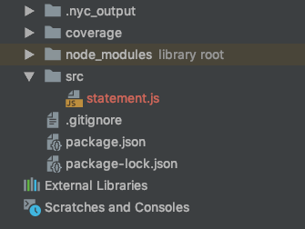
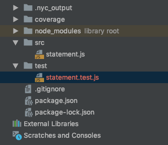
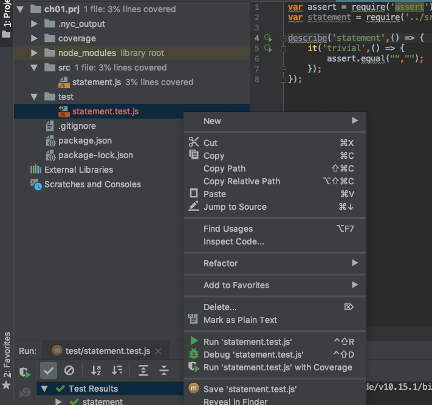
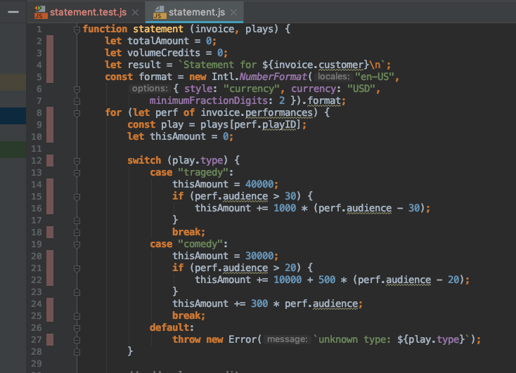
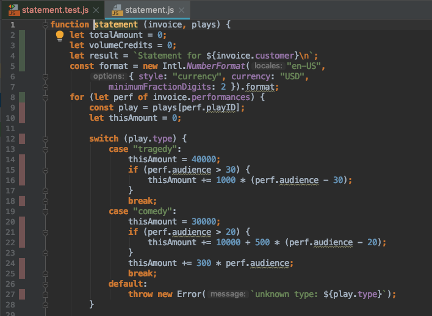
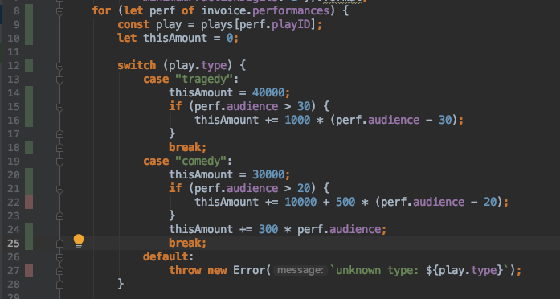
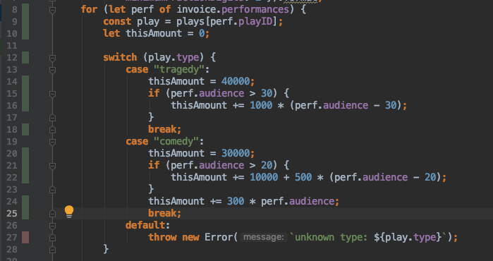

# 테스트 코드 작성 

Production 코드인 statement 에 대한 이해를 돕고, 리팩토링 작업을 수행할 때 기능 Feature 에 대한 오작동이 없음을 확인하기 위한 테스트 코드를 작성하는 절차에 대하여 소개하고자 합니다.


## Sample Bill 

statement 는 invoice 와 play 정보를 이용하여 해당 고객의 bill 정보를 출력하는 함수입니다. 아래 내용은 해당 입력과 출력에 대한 샘플 데이타입니다.

plays :

```
{
  "hamlet": {"name": "Hamlet", "type": "tragedy"},
  "as-like": {"name": "As You Like It", "type": "comedy"},
  "othello": {"name": "Othello", "type": "tragedy"}
}
```

invoice :

```
{
    "customer": "BigCo",
    "performances": [
      {
        "playID": "hamlet",
        "audience": 55
      },
      {
        "playID": "as-like",
        "audience": 35
      },
      {
        "playID": "othello",
        "audience": 40
      }
    ]
}
```

Bill for BigCo.

```
Statement for BigCo
  Hamlet: $650.00 (55 seats)
  As You Like It: $580.00 (35 seats)
  Othello: $500.00 (40 seats)
Amount owed is $1,730.00
You earned 47 credits
```


## 작업 프로젝트 생성 

### 1. Project Folder 생성

```
$ mkdir chapter01
$ cd chapter01
```


### 2. Git Project 생성

```
$ vi .gitingore
.nyc_output/
coverage/
node_modules/
.idea/
*.iml

$ git init

$ git add .
$ git status
$ git commit -m "init git project"
```


### 3. Node.js Project 설정

```json
$ npm init

$ cat package.json
{
  "name": "chapter01",
  "version": "1.0.0",
  "description": "",
  "main": "index.js",
  "scripts": {
    "test": "echo \"Error: no test specified\" && exit 1"
  },
  "author": "",
  "license": "ISC"
}
```


### 4. Node.js Package 추가

```bash
$ npm install
$ npm install --save-dev mocha
$ npm install --save-dev nyc

$ cat package.json
{
  "name": "chapter01",
  "version": "1.0.0",
  "description": "",
  "main": "index.js",
  "scripts": {
    "test": "echo \"Error: no test specified\" && exit 1"
  },
  "author": "",
  "license": "ISC",
  "devDependencies": {
    "mocha": "^6.0.2",
    "nyc": "^13.3.0"
  }
}
```


### 5. Test 및 Coverage 스크립트 설정

package.json 에 test 와 coverage 실행을 위한 scripts 추가한다. 아래의 내용을 package.json scripts 에 추가해 준다.

```
"test": "mocha test/**/*.js",
"coverage": "nyc --reporter=text --reporter=lcov mocha test/**/*.js"
```

```
$ cat package.json
{
  "name": "chapter01",
  "version": "1.0.0",
  "description": "",
  "main": "index.js",
  "scripts": {
    "test": "mocha test/**/*.js",
    "coverage": "nyc --reporter=text --reporter=lcov mocha test/**/*.js"
  },
  "author": "",
  "license": "ISC",
  "devDependencies": {
    "mocha": "^6.0.2",
    "nyc": "^13.3.0"
  }
}

```


### 6. 코드 commit

- 코드 commit

```
$ git status
$ git add .
$ git commit -m "init npm project"
```

- git alias 설정

```
$ git config --global alias.lol 'log --oneline --graph --decorate --all'
```

- git commit 목록 보기

```
$ git lol
```


### 7. Production Code 생성

아래의 자바스크립트 코드를 이용하여 statement production 코드를 생성한다.

```
$ mkdir src
$ touch src/statement.js
```





statement.js

```javascript
function statement (invoice, plays) {
  let totalAmount = 0;
  let volumeCredits = 0;
  let result = `Statement for ${invoice.customer}\n`;
  const format = new Intl.NumberFormat("en-US",
                        { style: "currency", currency: "USD",
                          minimumFractionDigits: 2 }).format;
  for (let perf of invoice.performances) {
    const play = plays[perf.playID];
    let thisAmount = 0;

    switch (play.type) {
    case "tragedy":
      thisAmount = 40000;
      if (perf.audience > 30) {
        thisAmount += 1000 * (perf.audience - 30);
      }
      break;
    case "comedy":
      thisAmount = 30000;
      if (perf.audience > 20) {
        thisAmount += 10000 + 500 * (perf.audience - 20);
      }
      thisAmount += 300 * perf.audience;
      break;
    default:
        throw new Error(`unknown type: ${play.type}`);
    }

    // add volume credits
    volumeCredits += Math.max(perf.audience - 30, 0);
    // add extra credit for every ten comedy attendees
    if ("comedy" === play.type) volumeCredits += Math.floor(perf.audience / 5);

    // print line for this order
    result += `  ${play.name}: ${format(thisAmount/100)} (${perf.audience} seats)\n`;
    totalAmount += thisAmount;
  }
  result += `Amount owed is ${format(totalAmount/100)}\n`;
  result += `You earned ${volumeCredits} credits\n`;
  return result;
}

module.exports = statement;
```

코드 commit :

```
$ git add .
$ git status
$ git commit -m "statement production code 작성"
```


## 테스트 코드 작성 절차

### 1. Trivial Test Code 작성

```
$ mkdir test
$ touch src/statement.test.js
```





statement.test.js 생성

```javascript
var assert = require('assert');
var statement = require('../src/statement');

describe('statement',() => {
    it('trivial',() => {
        assert.equal("","");
    });
});
```

```bash
$ npm run test

$ npm run coverage

```


### 2. WebStorm Code Coverage 확인 

statement.test.js 파일을 마우스 오른쪽 버튼을 이용하여 선택한 후, "Run 'statement.test.js' with Coverage" 를 실행한다. 




statement.js 파일을 오픈하여, 코드 coverage 상태을 확인해 보면 아래와 같이 코드 라인번호 옆에 색이 표시된다.




### 3. Invocie 공연 정보가 없는 경우

Test Code :

```
	const plays = {
        "hamlet": {"name": "Hamlet", "type": "tragedy"},
        "as-like": {"name": "As You Like It", "type": "comedy"},
        "othello": {"name": "Othello", "type": "tragedy"}
    };

    it('Invocie 공연 정보가 없는 경우',() => {
        let invoice = {
            "customer" : "BigCo",
            "performances" : []
        };
        let result = statement(invoice,plays);
        assert.equal(result,"Statement for BigCo\n" +
            "Amount owed is $0.00\n" +
            "You earned 0 credits\n");
    });
```

Test Coverage :




### 4. 장르는 tradegy, 공연 audience가 30 이하인 경우

Test Code :

```
	it('장르는 tradegy, 공연 audience가 30 이하인 경우',() => {
        let invoice = {
            "customer" : "BigCo",
            "performances" : [
                {
                    "playID": "hamlet",
                    "audience": 30
                }
            ]
        };
        let result = statement(invoice,plays);
        assert.equal(result,"Statement for BigCo\n" +
            "  Hamlet: $400.00 (30 seats)\n" +
            "Amount owed is $400.00\n" +
            "You earned 0 credits\n");
    });
```

Test Coverage :


### 5. 장르는 tradegy, 공연 audience가 30 보다 큰경우

Test Code :

```
	it('장르는 tradegy, 공연 audience가 30 보다 큰경우',() => {
        let invoice = {
            "customer" : "BigCo",
            "performances" : [
                {
                    "playID": "hamlet",
                    "audience": 31
                }
            ]
        };
        let result = statement(invoice,plays);
        assert.equal(result,"Statement for BigCo\n" +
            "  Hamlet: $410.00 (31 seats)\n" +
            "Amount owed is $410.00\n" +
            "You earned 1 credits\n");
    });
```

Test Coverage :


### 6. 장르는 comedy, 공연 audience가 20 이하인 경우

Test Code :

```
	it('장르는 comedy, 공연 audience가 20 이하인 경우',() => {
        let invoice = {
            "customer" : "BigCo",
            "performances" : [
                {
                    "playID": "as-like",
                    "audience": 20
                }
            ]
        };
        let result = statement(invoice,plays);
        assert.equal(result,"Statement for BigCo\n" +
            "  As You Like It: $360.00 (20 seats)\n" +
            "Amount owed is $360.00\n" +
            "You earned 4 credits\n");
    });
```

Test Coverage :




### 7. 장르는 comedy, 공연 audience가 20 보다 큰 경우

Test Code :

```

    it('장르는 comedy, 공연 audience가 20 보다 큰 경우',() => {
        let invoice = {
            "customer" : "BigCo",
            "performances" : [
                {
                    "playID": "as-like",
                    "audience": 21
                }
            ]
        };
        let result = statement(invoice,plays);
        assert.equal(result,"Statement for BigCo\n" +
            "  As You Like It: $468.00 (21 seats)\n" +
            "Amount owed is $468.00\n" +
            "You earned 4 credits\n");
    });

```

Test Coverage :




### 8. Unknown play type

Test Code :

```

    it('Unknown play type', () => {

        let plays = {
            "leo": {"name": "Who is leo", "type": "leo"}
        };

        let invoice =
            {
                "customer": "BigCo",
                "performances" : [
                    {
                        "playID": "leo",
                        "audience": 21
                    }
                ]
            };

        assert.throws(
            function(){
                statement(invoice, plays)
            },
            Error, "Error: unknown type: null");
    });
```

Test Coverage :


### 9. 한 고객이 여러 연극을 공연한 경우

```

    it('한 고객이 여러 연극을 공연한 경우', () => {

        let invoice =
            {
                "customer": "BigCo",
                "performances": [
                    {
                        "playID": "hamlet",
                        "audience": 55
                    },
                    {
                        "playID": "as-like",
                        "audience": 35
                    },
                    {
                        "playID": "othello",
                        "audience": 40
                    }
                ]
            };

        let result = statement(invoice,plays);

        assert.equal(result, "Statement for BigCo\n" +
            "  Hamlet: $650.00 (55 seats)\n" +
            "  As You Like It: $580.00 (35 seats)\n" +
            "  Othello: $500.00 (40 seats)\n" +
            "Amount owed is $1,730.00\n" +
            "You earned 47 credits\n");
    });
```


### 10. Code Commit

```
$ git add .
$ git status
$ git commit -m "refactoring을 위한 test code 작성"
```

