# DECOMPOSING THE `STATEMENT` FUNCTION

## 작업 준비

아래와 같이 git 명령어를 이용하여 리팩토링 작업을 수행할 코드로 이동한다.

```
git checkout -B part3 tagPart3 --force
```


## 시작하기에 앞서

-  왜 리팩토링을 해야 하는가?
-  무엇을 어떻게 리팩토링해야 하는가?
-  코드 변경 후 이상이 없다는 것을 어떻게 확인할 것인가?


```javascript
function statement (invoice, plays) {
    let totalAmount = 0;
    let volumeCredits = 0;
    let result = `Statement for ${invoice.customer}\n`;
    const format = new Intl.NumberFormat("en-US",
        { style: "currency", currency: "USD",
            minimumFractionDigits: 2 }).format;
    for (let perf of invoice.performances) {
        const play = plays[perf.playID];
        let thisAmount = 0;

        switch (play.type) {
            case "tragedy":
                thisAmount = 40000;
                if (perf.audience > 30) {
                    thisAmount += 1000 * (perf.audience - 30);
                }
                break;
            case "comedy":
                thisAmount = 30000;
                if (perf.audience > 20) {
                    thisAmount += 10000 + 500 * (perf.audience - 20);
                }
                thisAmount += 300 * perf.audience;
                break;
            default:
                throw new Error(`unknown type: ${play.type}`);
        }

        // add volume credits
        volumeCredits += Math.max(perf.audience - 30, 0);
        // add extra credit for every ten comedy attendees
        if ("comedy" === play.type) volumeCredits += Math.floor(perf.audience / 5);

        // print line for this order
        result += `  ${play.name}: ${format(thisAmount/100)} (${perf.audience} seats)\n`;
        totalAmount += thisAmount;
    }
    result += `Amount owed is ${format(totalAmount/100)}\n`;
    result += `You earned ${volumeCredits} credits\n`;
    return result;
}
```


## 1. amountFor 리팩토링

### 코드 분석

- statement for 문 내에 각각의 performance 에 대한 금액을 계산하는 switch 문이 존재한다.
- 이를  별도의 함수로 추출하면 for 문을 이해하기도 쉽고 나중에 switch 문을 리팩토링할 때도 편리할 것 같다.


### amountFor 함수 추출

- amountFor 함수 추출

  - 아래와 같이 amountFor 코드 영역을 선택하고,  "Extract Method" 리팩토링을 수행하면 아래와 같이 "Selected fragment has multiple exit points" 문구가 출력되는 경우가 있다.
  - 리팩토링 문구 예시 :  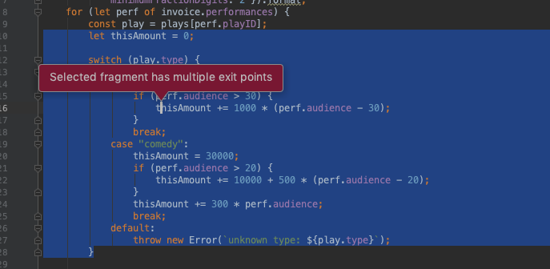

- 수작업 amountFor 함수 생성

  - 아래 코드를 이용하여 수작업으로 amountFor 함수를 생성하고 이를 추가한다.

    ```
        function amountFor(perf, play) {
            let thisAmount = 0;
    
            switch (play.type) {
                case "tragedy":
                    thisAmount = 40000;
                    if (perf.audience > 30) {
                        thisAmount += 1000 * (perf.audience - 30);
                    }
                    break;
                case "comedy":
                    thisAmount = 30000;
                    if (perf.audience > 20) {
                        thisAmount += 10000 + 500 * (perf.audience - 20);
                    }
                    thisAmount += 300 * perf.audience;
                    break;
                default:
                    throw new Error(`unknown type: ${play.type}`);
            }
    
            return thisAmount;
        }
    ```

    

- 리팩토링할 코드 영역을 지우고 amountFor 함수 호출로 변경한다. 


- 리팩토링 후 코드 예시 : 

  ```javascript
  function statement (invoice, plays) {
      let totalAmount = 0;
      let volumeCredits = 0;
      let result = `Statement for ${invoice.customer}\n`;
      const format = new Intl.NumberFormat("en-US",
          { style: "currency", currency: "USD",
              minimumFractionDigits: 2 }).format;
      for (let perf of invoice.performances) {
          const play = plays[perf.playID];
          let thisAmount = amountFor(perf, play);
  
          // add volume credits
          volumeCredits += Math.max(perf.audience - 30, 0);
          // add extra credit for every ten comedy attendees
          if ("comedy" === play.type) volumeCredits += Math.floor(perf.audience / 5);
  
          // print line for this order
          result += `  ${play.name}: ${format(thisAmount/100)} (${perf.audience} seats)\n`;
          totalAmount += thisAmount;
      }
      result += `Amount owed is ${format(totalAmount/100)}\n`;
      result += `You earned ${volumeCredits} credits\n`;
      return result;
  
      function amountFor(perf, play) {
          let thisAmount = 0;
  
          switch (play.type) {
              case "tragedy":
                  thisAmount = 40000;
                  if (perf.audience > 30) {
                      thisAmount += 1000 * (perf.audience - 30);
                  }
                  break;
              case "comedy":
                  thisAmount = 30000;
                  if (perf.audience > 20) {
                      thisAmount += 10000 + 500 * (perf.audience - 20);
                  }
                  thisAmount += 300 * perf.audience;
                  break;
              default:
                  throw new Error(`unknown type: ${play.type}`);
          }
  
          return thisAmount;
      }
  }
  ```

- 테스트 수행

  - 테스트가 전부 통과되었는지 확인한다.


### amountFor  지역변수 이름 변경

- amountFor 내에서 사용하는 지역변수 thisAmount 를 코딩 스타일에 맞게 변경한다.
  - 여기서는 책에서 언급한 저자의 스타일을 따른다.
  - thisAmount 를 result 로 이름을 변경해 준다.
  - Refactor "Rename" 메뉴를 선택한다. 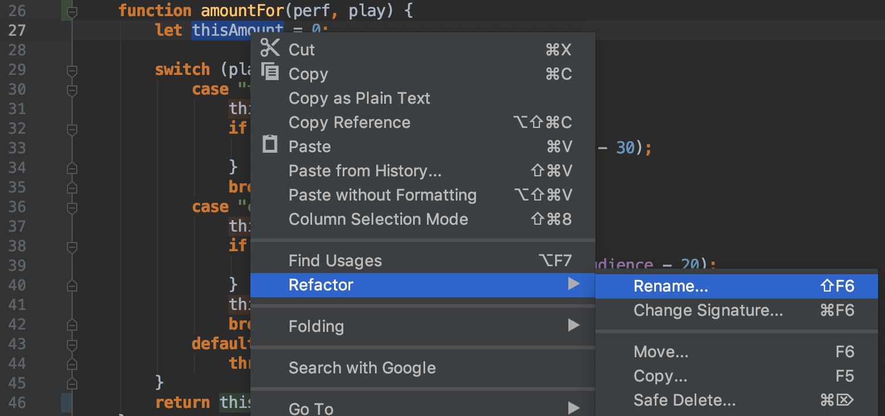
  - 리팩토링 수행 후 : 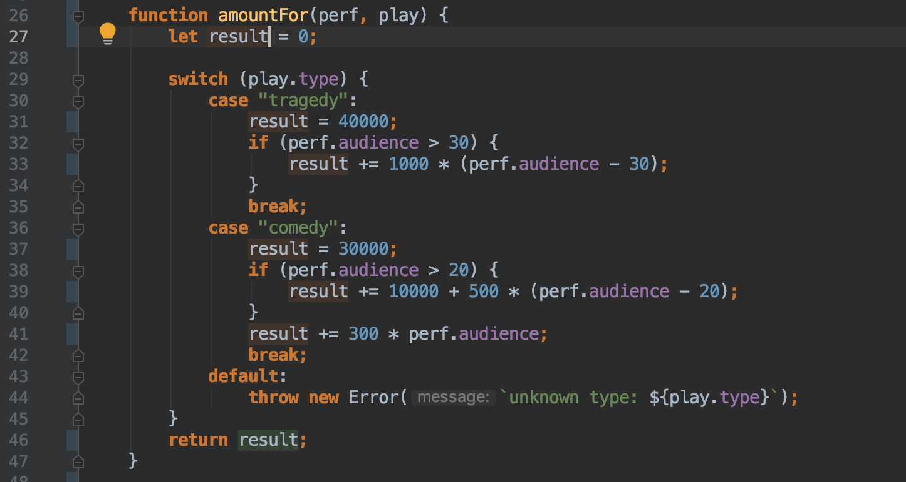
- 테스트 수행
  - 테스트를 수행하고 그 결과를 확인한다.


### amountFor 파라미터 이름 변경

- 파라미터 perf를 각자의 코딩 스타일에 맞게 변경한다.
  - 여기서는 책에서 언급한 저자의 스타일을 따른다.

  - perf 를 aPerformance 로 변경하여 함수 파라미터에 타입 및 의미를 부여한다.

  - Refactor "Rename" 메뉴를 이용하여 perf 를 **aPerformance** 로 변경한다.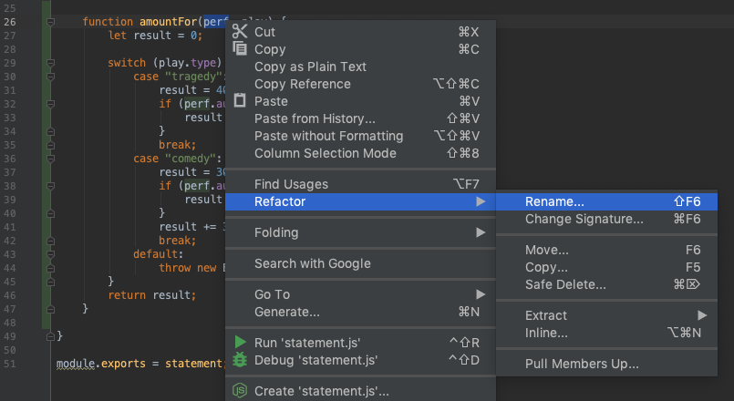

  - 리팩토링 수행 후 코드 예시 : 

    ```javascript
        function amountFor(aPerformance, play) {
            let result = 0;
    
            switch (play.type) {
                case "tragedy":
                    result = 40000;
                    if (aPerformance.audience > 30) {
                        result += 1000 * (aPerformance.audience - 30);
                    }
                    break;
                case "comedy":
                    result = 30000;
                    if (aPerformance.audience > 20) {
                        result += 10000 + 500 * (aPerformance.audience - 20);
                    }
                    result += 300 * aPerformance.audience;
                    break;
                default:
                    throw new Error(`unknown type: ${play.type}`);
            }
            return result;
        }
    ```

    

- 테스트 수행

  - 테스트를 수행하고 그 결과를 확인한다.


### thisAmount 인라인 수행

- thisAmount 변수 참조를 인라인을 이용하여 함수 호출로 변경하고, 이를 삭제한다.

  - thisAmount 변수를 선택하고, Refactor "Inline" 메뉴를 실행한다. 

  - Inline 안내창 : 

  - 리택토링 후 코드 예시 :  

    ```javascript
    function statement (invoice, plays) {
        let totalAmount = 0;
        let volumeCredits = 0;
        let result = `Statement for ${invoice.customer}\n`;
        const format = new Intl.NumberFormat("en-US",
            { style: "currency", currency: "USD",
                minimumFractionDigits: 2 }).format;
        for (let perf of invoice.performances) {
            const play = plays[perf.playID];
            // add volume credits
            volumeCredits += Math.max(perf.audience - 30, 0);
            // add extra credit for every ten comedy attendees
            if ("comedy" === play.type) volumeCredits += Math.floor(perf.audience / 5);
    
            // print line for this order
            result += `  ${play.name}: ${format(amountFor(perf, play)/100)} (${perf.audience} seats)\n`;
            totalAmount += amountFor(perf, play);
        }
        result += `Amount owed is ${format(totalAmount/100)}\n`;
        result += `You earned ${volumeCredits} credits\n`;
        return result;
    ```

    

- 테스트 수행

  - 테스트를 수행하고 그 결과를 확인한다.


## 2. play 변수 제거

### 코드 분석

- amountFor 에서 사용하는 play 정보는 함수 호출부에서 파라미터로 전달된다. 
- 코드를 분석해 보면 해당 데이타 play 객체는 performance 의 playID를 통하여 참조할 수 있음을 알 수 있다. 
- 따라서 이 부분을 파라미터를 이용한 전달이 아닌 함수호출로 변경하고자 한다.
- 코드가 긴 함수를 리팩토링하고자 할 때 for 문의 임시 변수 play를 제거하면 리팩토링을 수행하는데 매우 편리해 진다.
- 관련 리팩토링 기법 :
  - Extract Function
  - Replace Temp with Query
  - Inline Variable


### playFor 함수 추출

- playFor 함수 추출
  - for 문 내에서 play 정보를 검색하는 아래 코드를 선택한다.  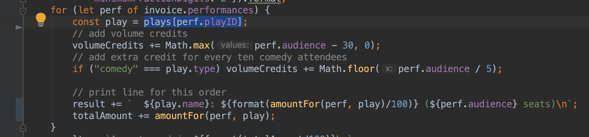
  - Refactor "Extract Method" 를 이용하여 playFor 함수를 추출한다.   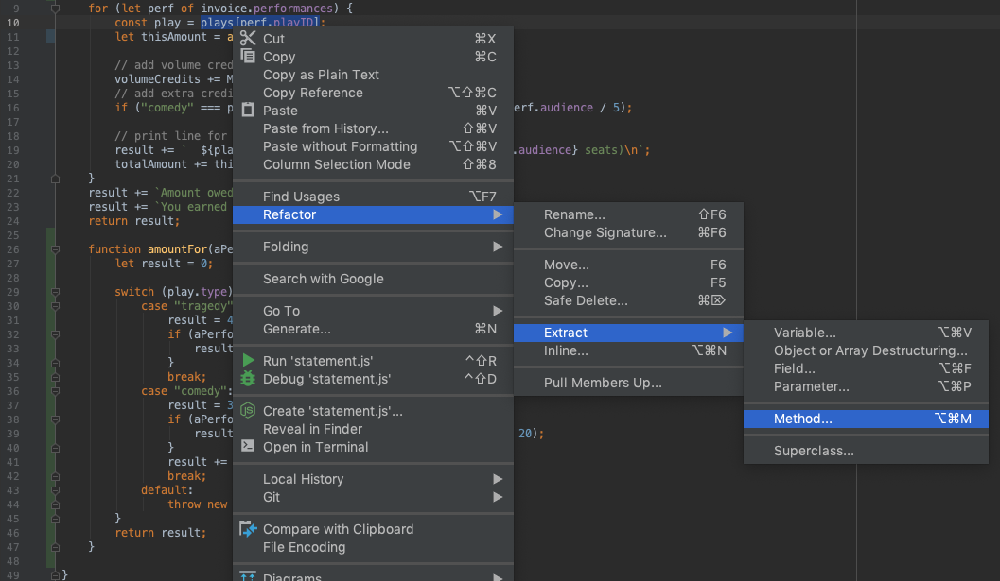
  - 함수 생성 Scope는 "function statement"를 선택한다.   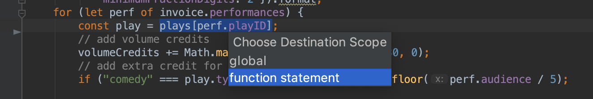
  - 리팩토링 후 :  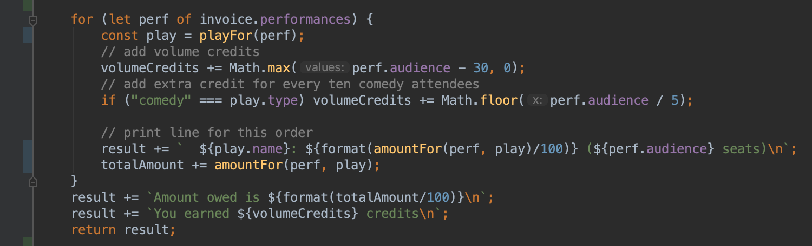
- 테스트 수행
  - 테스트를 수행하고 그 결과를 확인한다.
- 생성된 함수는 amountFor 함수 위치 바로 위로 이동하여 코드를 정리한다. 
  - 리팩토링 후 : 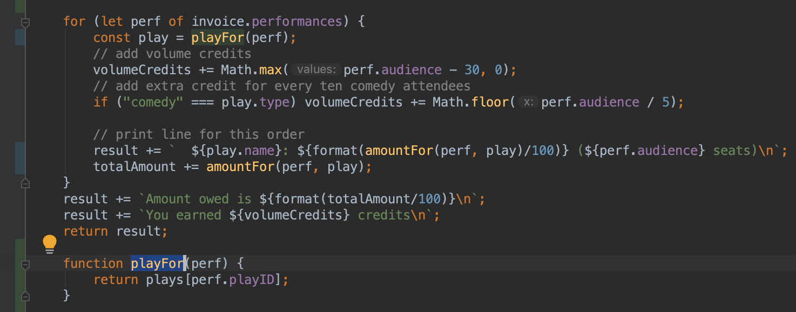
- 테스트 수행
  - 테스트를 수행하고 그 결과를 확인한다.


### playFor 파라미터 perf 이름 변경

- playFor  파라미터 perf를 코딩 스타일에 맞게 변경한다.
  - perf 를 aPerformance 로 변경하여 함수 파라미터에 타입 및 의미를 부여한다.

  - Refactor "Rename" 메뉴를 이용하여 함수 파라미터 명칭을 한번에 변경한다. 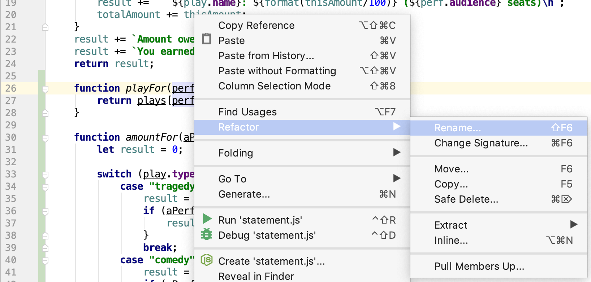

  - 리랙토링 후 코드 예시 :  

    ```javascript
        function playFor(aPerformance) {
            return plays[aPerformance.playID];
        }
    ```

- 테스트 수행

  - 테스트를 수행하고 그 결과를 확인한다.


### play 변수 인라인 수행

- for 문 내에 존재하는 play 변수를 리팩토링 "Inline Variable" 를 이용하여 제거한다.
  - play 변수를 선택하고 Refactor "Inline Variable" 메뉴를 선택한다.  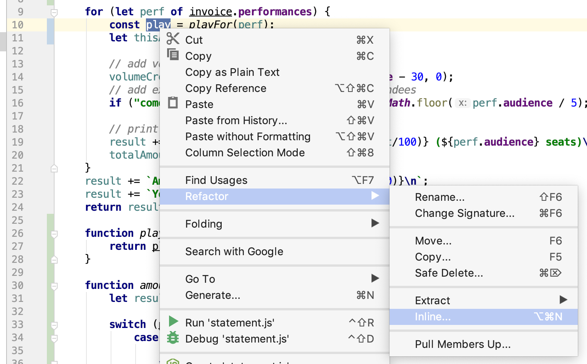

  - Inline 옵션을 선택하고 "Refactor" 를 선택한다. 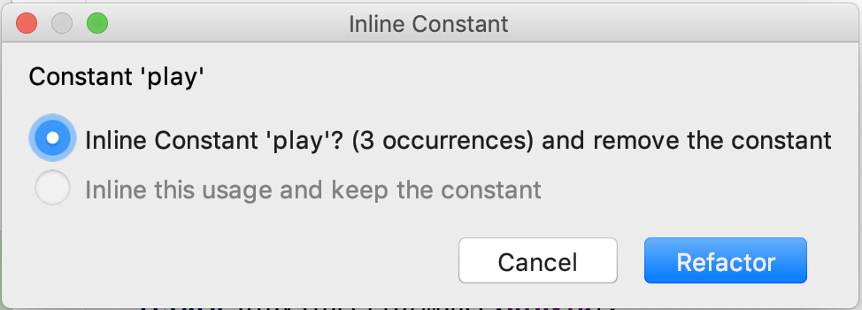

  - 리팩토링 후 코드 예시 : 

    ```javascript
    function statement (invoice, plays) {
        let totalAmount = 0;
        let volumeCredits = 0;
        let result = `Statement for ${invoice.customer}\n`;
        const format = new Intl.NumberFormat("en-US",
            { style: "currency", currency: "USD",
                minimumFractionDigits: 2 }).format;
    
        for (let perf of invoice.performances) {
            // add volume credits
            volumeCredits += Math.max(perf.audience - 30, 0);
            // add extra credit for every ten comedy attendees
            if ("comedy" === playFor(perf).type) volumeCredits += Math.floor(perf.audience / 5);
    
            // print line for this order
            result += `  ${playFor(perf).name}: ${format(amountFor(perf, playFor(perf))/100)} (${perf.audience} seats)\n`;
            totalAmount += amountFor(perf, playFor(perf));
        }
        result += `Amount owed is ${format(totalAmount/100)}\n`;
        result += `You earned ${volumeCredits} credits\n`;
        return result;
    ```

- 테스트 수행

  - 테스트를 수행하고 그 결과를 확인한다.


### amountFor play 참조 변경

- amountFor 함수 내 play 변수를 playFor 함수로 변경한다.
  - switch 문과 default 문의 play 객체 참조를 playFor(aPerformance) 함수 호출로 변경해 준다. 
  - Refactor Rename 메뉴를 이용하여 리팩토링을 수행하면  함수 파라미터까지 영향을 받아 정상 작동하지 않는다. 
  - amountFor 함수 코드에서 play 참조를  수작업으로 playFor(aPerformance) 로 변경한다.
  - 리팩토링 전 : 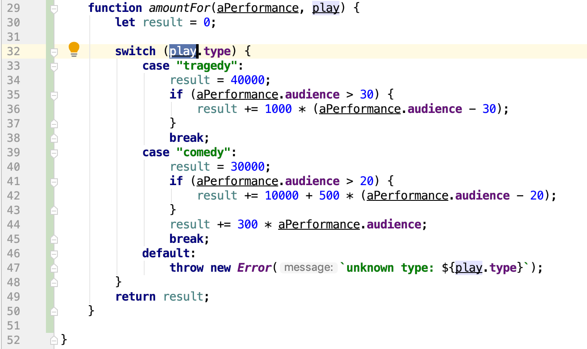
  - 리팩토링 후  : 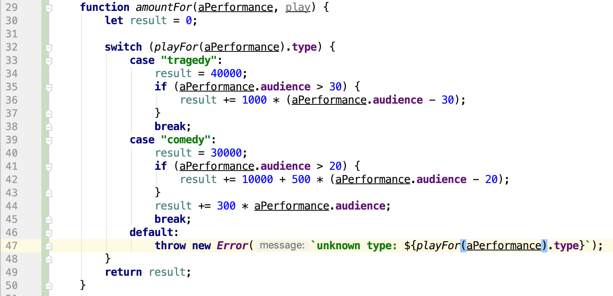
- 테스트 수행
  - 테스트를 수행하고 그 결과를 확인한다.


### amountFor 파라미터 play 제거
- 코드를 보면 amountFor 로 전달되는 파라미터 play가 amountFor 함수 코드 내에서 사용되지 않는다. 

- 파라미터 play를 "Change Signature" 리팩토링을 이용하여 제거한다.

- amountFor 파라미터 play 제거
  - amountFor 함수를 선택한 후, Refactor "ChangeSignature" 메뉴를 선택한다.
    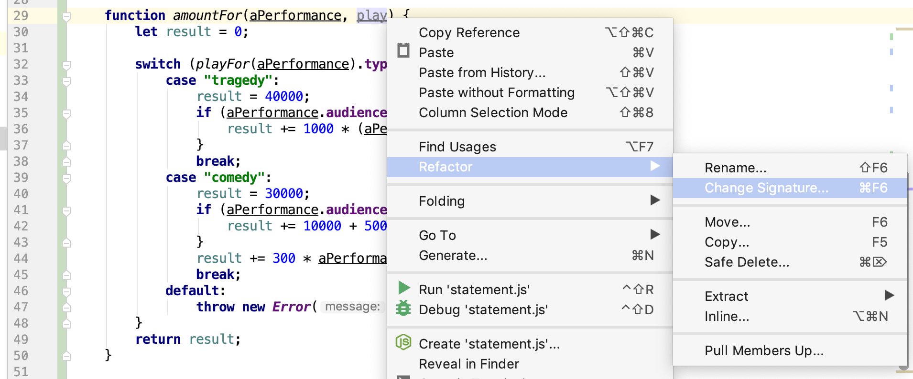

  - play 을 삭제한 후, "Refactor" 버튼을 클리한다.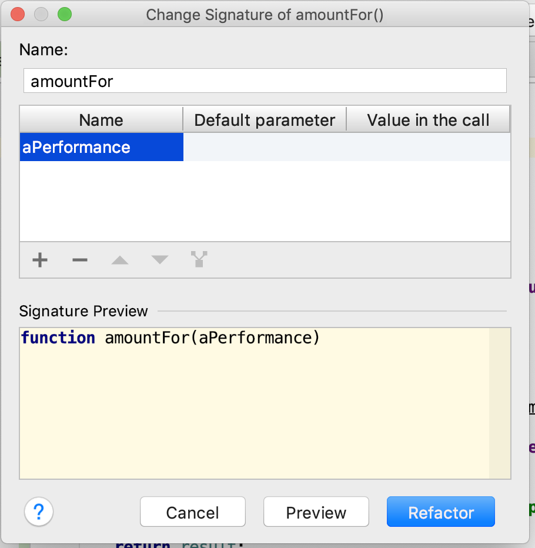

  - 리팩토링 후 코드 예시 : 

    ```javascript
        function amountFor(aPerformance) {
            let result = 0;
    
            switch (playFor(aPerformance).type) {
                case "tragedy":
                    result = 40000;
                    if (aPerformance.audience > 30) {
                        result += 1000 * (aPerformance.audience - 30);
                    }
                    break;
                case "comedy":
                    result = 30000;
                    if (aPerformance.audience > 20) {
                        result += 10000 + 500 * (aPerformance.audience - 20);
                    }
                    result += 300 * aPerformance.audience;
                    break;
                default:
                    throw new Error(`unknown type: ${playFor(aPerformance).type}`);
            }
            return result;
        }
    ```

- 테스트 수행

  - 테스트를 수행하고 그 결과를 확인한다.


## 3. Volume Credits 계산 추출

### volumeCreditsFor 함수 추출

- 리팩토링 편의를 위해 임시 변수 추가
  - 리팩토링 전 코드 : 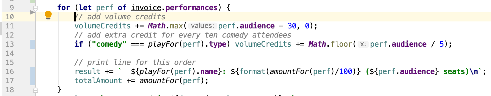
  - 리팩토링 편의를 위해 아래와 같이 임시변수 vvv 를 추가한다.  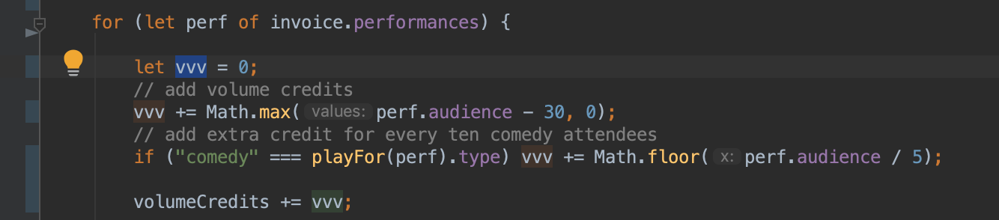
- 테스트 수행
  - 테스트를 수행하고 그 결과를 확인한다.
- volumeCreditsFor 함수 추출
  - Refactor "Extact Method" 메뉴를 선택한다.   
  - 함수 생성 위치(Scope)는 "function statement"를 선택한다.
- 테스트 수행
  - 테스트를 수행하고 그 결과를 확인한다.
- 생성된 함수는 아래로 이동하여 코드를 정리한다. 
  - 리랙토링 후 :   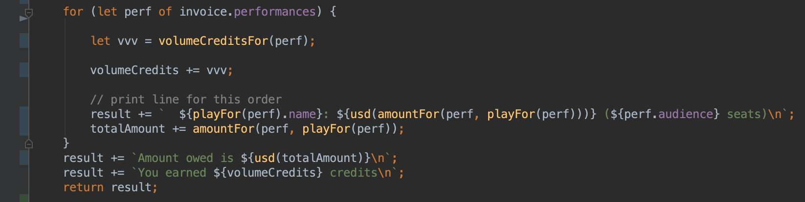
- 테스트 수행
  - 테스트를 수행하고 그 결과를 확인한다.


### volumeCreditsFor 지역변수 이름 변경

- volumeCreditsFor 함수 내에서 지역변수 vvv 를 선택하고 Refactor "Rename" 메뉴을 이용하여 result 로 이름을 변경한다.
  - 수정하고자 하는 변수를 선택한 후, Refactor "Rename" 메뉴를 선택한다.  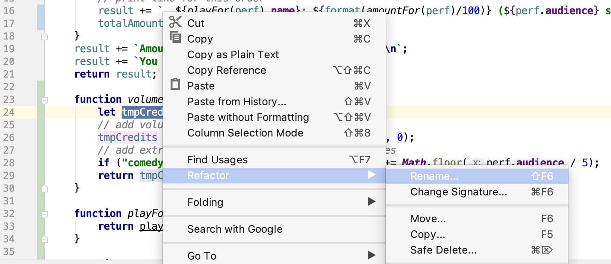
  - 리팩토링 이후 : 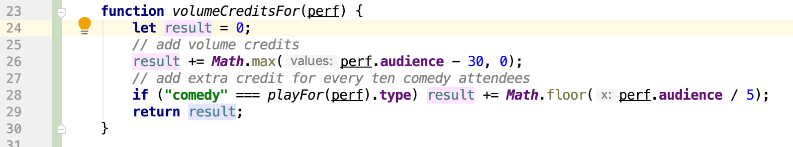
- 테스트 수행
  - 테스트를 수행하고 그 결과를 확인한다.


### volumeCreditsFor 파라미터 이름 변경

- volumeCreditsFor 파라미터 perf 를 aPerformance 로 변경한다.
  - 파라미터 perf 를 선택한 후, Refactor "Rename" 메뉴를 선택한다.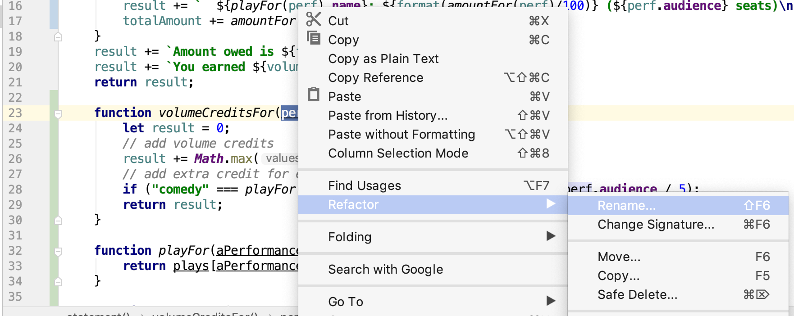
  - 리팩토링 후 : 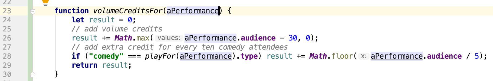
- 테스트 수행
  - 테스트를 수행하고 그 결과를 확인한다.


### 임시 변수 제거

- 임시로 생성한  tmpCredits 를 인라인 리팩토링을 이용하여 코드에서 제거한다.
  - tmpCredits 를 선택한 후, Refactor "Inline" 메뉴를 선택한다.   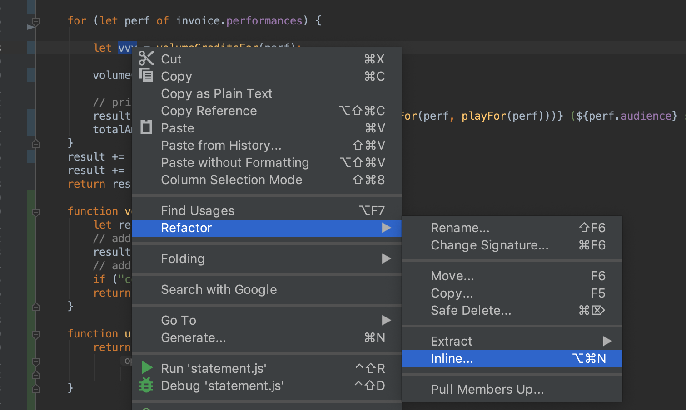
  - 내용을 확인하고 Refactor 버튼을 선택한다.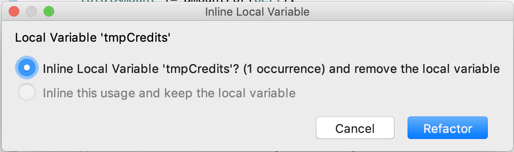
  - 리팩토링 후 : 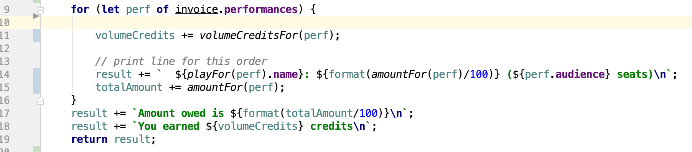

- 테스트 수행
  - 테스트를 수행하고 그 결과를 확인한다.


## 4. US 통화 포맷 함수 리팩토링

### 코드 분석

- format 변수를 보면 US 달러로 숫자 포맷을 변환하기 위해 선언되어 있다.
- 이를 함수로 치환해 두면 가독성 좋아지고 리팩토링 작업이 원활해진다.

- format 변수 코드 : 
    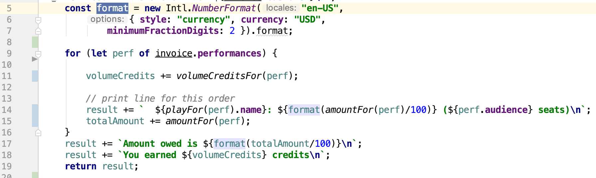

### format 함수 생성

- format 함수를 생성한다.

  - 원본 코드 format 코드를 이용하여 아래 코드와 같은 함수를 생성한다.

  - ```javascript
    function format(aNumber) {
      return new Intl.NumberFormat("en-US",
                          { style: "currency", currency: "USD",
                            minimumFractionDigits: 2 }).format(aNumber);
    }
    ```

  - 원본 코드 format 과 충돌이 난다. 
    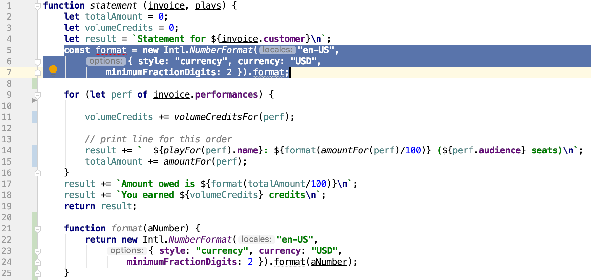

  - 원본 코드에서 충돌이 나는 부분을 삭제한다.
    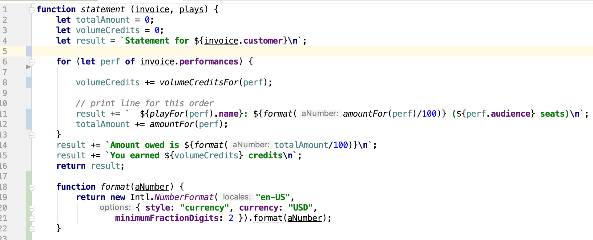

- 테스트 수행

  - 테스트를 수행하고 그 결과를 확인한다.


### usd 로 함수명 변경

- format 함수 이름을 usd 로 변경한다.
  - 함수가 출력하는 통화가 USD 임으로, 이를 직관적으로 알 수 있도록 함수명을 usd 로 변경한다.
  - for 문 코드 내에서 format 변수를 선택한다.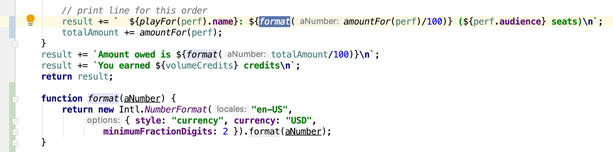
  - Refactor "Rename" 메뉴를 선택한다. 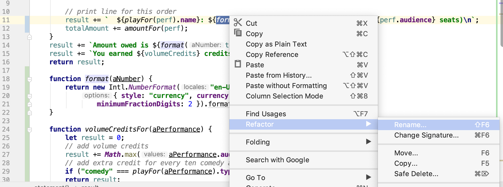
  - usd 로 이름을 변경한다. 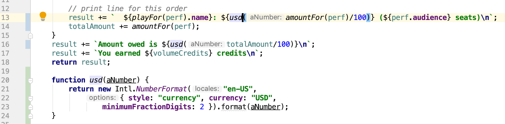
- 테스트 수행
  - 테스트를 수행하고 그 결과를 확인한다.


### usd 입력 통화 단위 수정

- usd 함수 호출과 출력 부분을 분석해 보면 통화 단위가 달러임을 알 수 있다. 
- 그러나 프로그램에서 관리하는 amount 단위는 cent 이다. 
- cent를 달러로 변환하는 코드가 2번 중복되어 있음을 확인할 수 있다.  
- usd 함수 입력 단위 자체를 cent라고 가정하고 코드를 수정하여 중복을 제거한다.
- 리팩토링 후 : 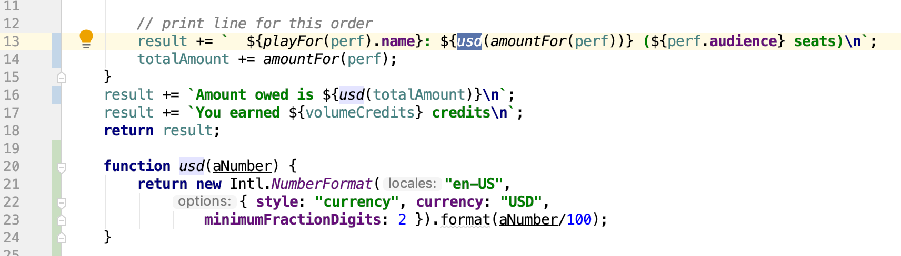
- 테스트 수행
  - 테스트를 수행하고 그 결과를 확인한다.


## 5. Total Volume Credits 리팩토링

### Total Volume Credits 계산을 위한 for 문 분리

- statement 함수 for 문 total volumeCredits 계산하는 부분을 아래와 같이 분리한다. 
  - 리팩토링 후 : 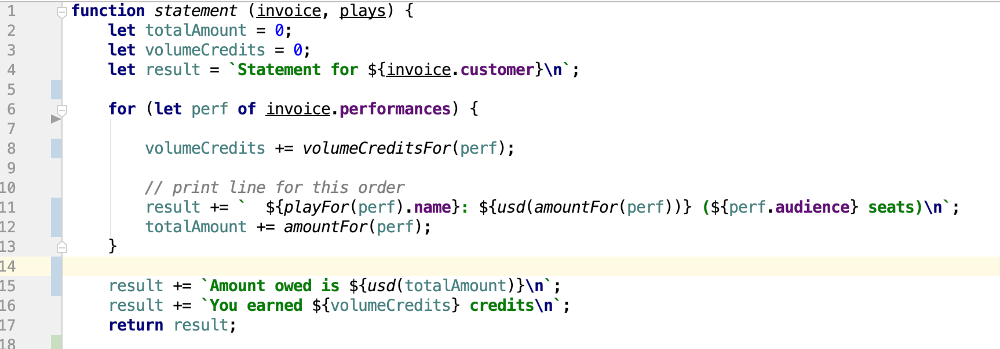

  - 리팩토링 후 코드 예시 : 

    ```javascript
    function statement (invoice, plays) {
        let totalAmount = 0;
        let volumeCredits = 0;
        let result = `Statement for ${invoice.customer}\n`;
    
        for (let perf of invoice.performances) {
            // print line for this order
            result += `  ${playFor(perf).name}: ${usd(amountFor(perf))} (${perf.audience} seats)\n`;
            totalAmount += amountFor(perf);
        }
    
        for (let perf of invoice.performances) {
            volumeCredits += volumeCreditsFor(perf);
        }
    
        result += `Amount owed is ${usd(totalAmount)}\n`;
        result += `You earned ${volumeCredits} credits\n`;
        return result;
    ```

- 테스트 수행

  - 테스트를 수행하고 그 결과를 확인한다.
- volumeCredits 초기화 문장 volumeCredits 을 for문 바로 위로 이동한다.
  - 리팩토링에서는 이를 [Slide Statements](https://refactoring.com/catalog/slideStatements.html) 라고 한다.

  - 리팩토링 후 : 

    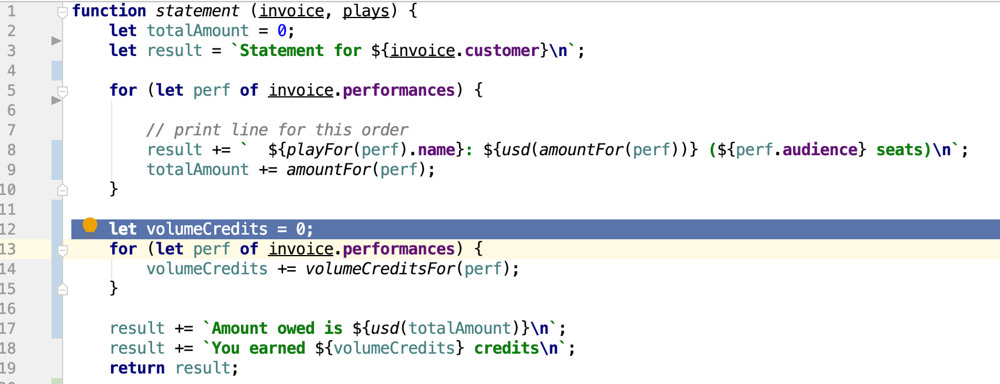

  - 리팩토링 후 코드 예시 : 

    ```javascript
    function statement (invoice, plays) {
        let totalAmount = 0;
        let result = `Statement for ${invoice.customer}\n`;
    
        for (let perf of invoice.performances) {
            // print line for this order
            result += `  ${playFor(perf).name}: ${usd(amountFor(perf))} (${perf.audience} seats)\n`;
            totalAmount += amountFor(perf);
        }
    
        let volumeCredits = 0;
        for (let perf of invoice.performances) {
            volumeCredits += volumeCreditsFor(perf);
        }
    
        result += `Amount owed is ${usd(totalAmount)}\n`;
        result += `You earned ${volumeCredits} credits\n`;
        return result;
    ```

- 테스트 수행

  - 테스트를 수행하고 그 결과를 확인한다.


### totalVolumeCredits 추출

- totalVolumeCredits 를 계산하는 코드를 선택하고 이를 totalVolumeCredits 함수로 추출한다.
  - totalVolumeCredits 를 계산하기 위한 코드를 선택한 후, Refactor "Extract Method" 메뉴를 선택한다.  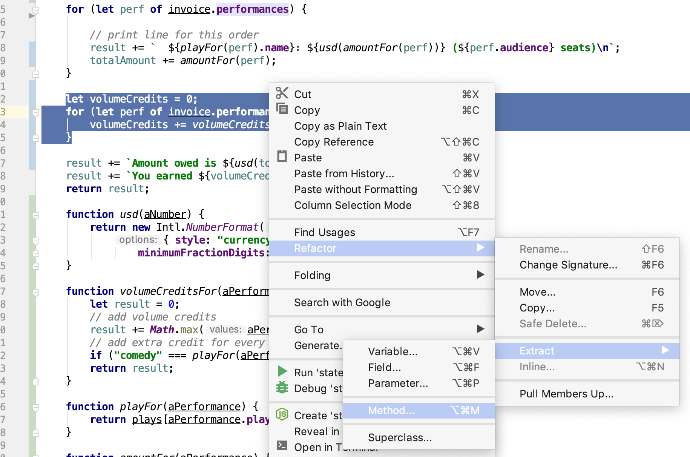

  - 함수 생성 위치(Scope)는 "function statement"를 선택한다. 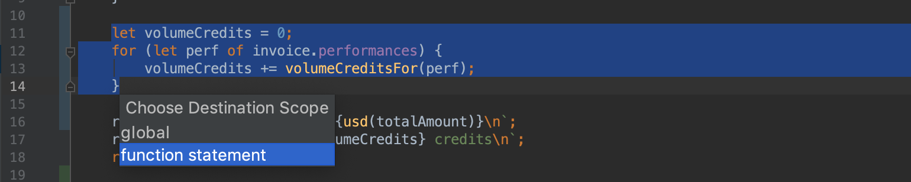

  - 생성된 함수는 아래로 이동하여 코드를 정리한다. 

  - 리팩토링 후 코드 예시 : 

    ```javascript
    function statement (invoice, plays) {
        let totalAmount = 0;
        let result = `Statement for ${invoice.customer}\n`;
    
        for (let perf of invoice.performances) {
            // print line for this order
            result += `  ${playFor(perf).name}: ${usd(amountFor(perf))} (${perf.audience} seats)\n`;
            totalAmount += amountFor(perf);
        }
    
        let volumeCredits = totalVolumeCredits();
    
        result += `Amount owed is ${usd(totalAmount)}\n`;
        result += `You earned ${volumeCredits} credits\n`;
        return result;
    
        function totalVolumeCredits() {
            let volumeCredits = 0;
            for (let perf of invoice.performances) {
                volumeCredits += volumeCreditsFor(perf);
            }
            return volumeCredits;
        }
    ```

- 테스트 수행

  - 테스트를 수행하고 그 결과를 확인한다.


### volumeCredits 변수 인라인 수행

- 임시 변수 volumeCredits 참조를 인라인 리팩토링을 이용하여 totalVolumeCredits 함수 호출로 대치한다.

  - volumeCredits 변수를 선택한 후, Refactor "Inline" 메뉴를 선택한다.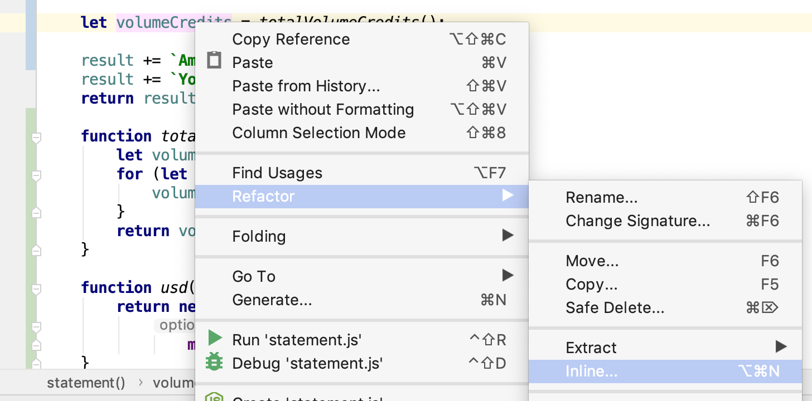

  - 문구를 확인한 후, "Refactor" 버튼을 선택한다.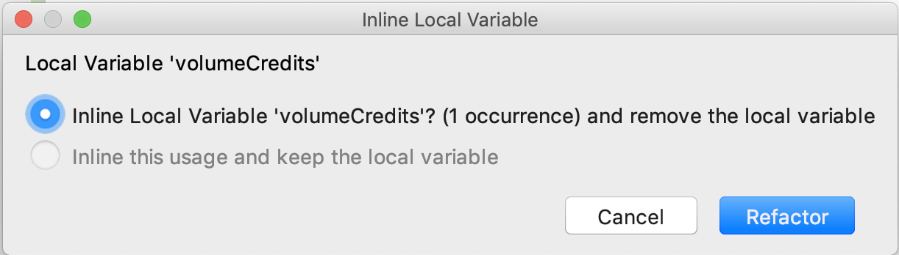

  - 래팩토링 후 코드 예시 : 

    ```javascript
    function statement (invoice, plays) {
        let totalAmount = 0;
        let result = `Statement for ${invoice.customer}\n`;
    
        for (let perf of invoice.performances) {
            // print line for this order
            result += `  ${playFor(perf).name}: ${usd(amountFor(perf))} (${perf.audience} seats)\n`;
            totalAmount += amountFor(perf);
        }
    
        result += `Amount owed is ${usd(totalAmount)}\n`;
        result += `You earned ${totalVolumeCredits()} credits\n`;
        return result;
    ```

- 테스트 수행

  - 테스트를 수행하고 그 결과를 확인한다.


## 6. Total Amount 리팩토링


### Total Amount 계산을 위한 for 문 분리

- statement 문의 for 문을 totalAmount 를 계산하기 위하여 아래와 같이 분리한다. 

  - 리팩토링 후 : 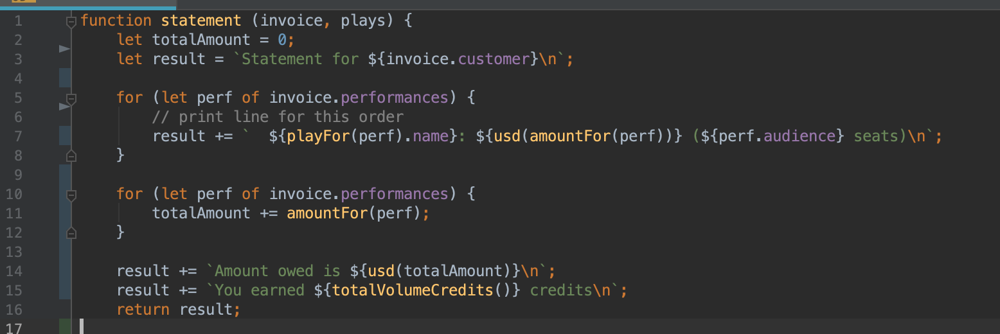

  - 코드 예시 : 

  - ```javascript
    function statement (invoice, plays) {
        let totalAmount = 0;
        let result = `Statement for ${invoice.customer}\n`;
    
        for (let perf of invoice.performances) {
            // print line for this order
            result += `  ${playFor(perf).name}: ${usd(amountFor(perf))} (${perf.audience} seats)\n`;
        }
    
        for (let perf of invoice.performances) {
            totalAmount += amountFor(perf);
        }
    
        result += `Amount owed is ${usd(totalAmount)}\n`;
        result += `You earned ${totalVolumeCredits()} credits\n`;
        return result;
    ```

- 테스트 수행

  - 테스트를 수행하고 그 결과를 확인한다.


### totalAmount 변수 초기화 문장 이동

- totalAmount 선언 문장을 for 문 바로 위까지 이동한다.

  - 리픽토링 후 : 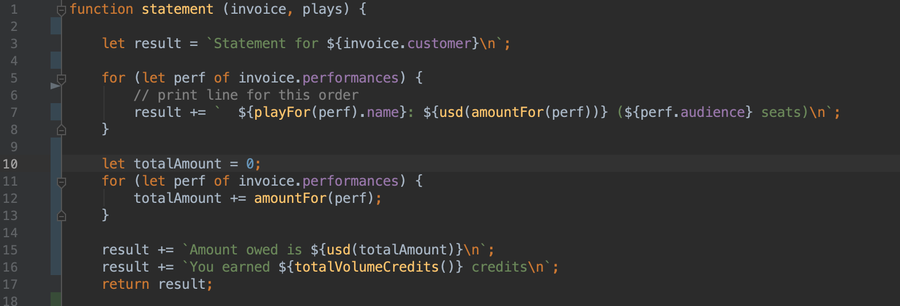

  - 코드 예시 :

  - ```javascript
    function statement (invoice, plays) {
    
        let result = `Statement for ${invoice.customer}\n`;
    
        for (let perf of invoice.performances) {
            // print line for this order
            result += `  ${playFor(perf).name}: ${usd(amountFor(perf))} (${perf.audience} seats)\n`;
        }
    
        let totalAmount = 0;
        for (let perf of invoice.performances) {
            totalAmount += amountFor(perf);
        }
    
        result += `Amount owed is ${usd(totalAmount)}\n`;
        result += `You earned ${totalVolumeCredits()} credits\n`;
        return result;
    ```

- 테스트 수행

  - 테스트를 수행하고 그 결과를 확인한다.


### 전체 금액 계산 함수 추출

- 전체 금액 계산을 위한 함수 appleSauce 를 추출한다.

  - 저자는 함수명으로 totalAmount 를 사용하고 싶었으나 이미 같은 이름을 가진 변수가 존재하여 임으로 지정하고 추후 "Rename Funciton"을 이용하여 이름을 변경하고자 하였다.

  - 리팩토링 메뉴 : 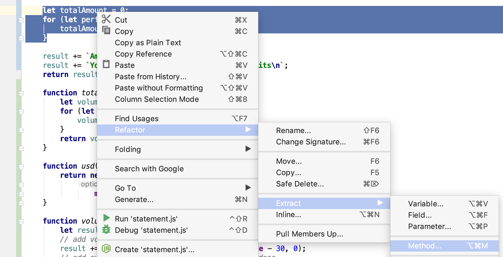

  - 함수 생성 위치(Scope)는 "function statement"를 선택한다. 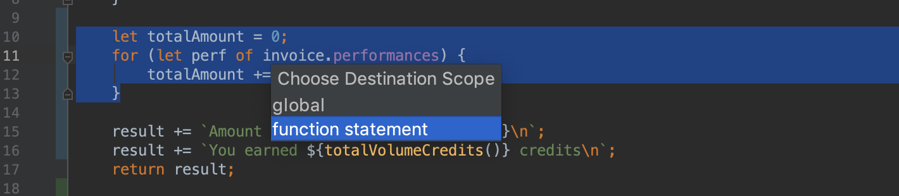

  - 생성된 함수는 아래로 이동하여 코드를 정리한다.  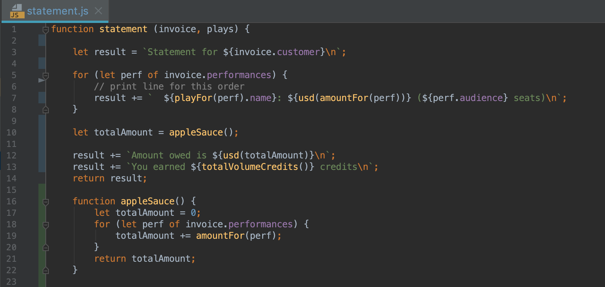

  - 코드 예시  :

  - ```javascript
    function statement (invoice, plays) {
    
        let result = `Statement for ${invoice.customer}\n`;
    
        for (let perf of invoice.performances) {
            // print line for this order
            result += `  ${playFor(perf).name}: ${usd(amountFor(perf))} (${perf.audience} seats)\n`;
        }
    
        let totalAmount = appleSauce();
    
        result += `Amount owed is ${usd(totalAmount)}\n`;
        result += `You earned ${totalVolumeCredits()} credits\n`;
        return result;
    
        function appleSauce() {
            let totalAmount = 0;
            for (let perf of invoice.performances) {
                totalAmount += amountFor(perf);
            }
            return totalAmount;
        }
    ```

- 테스트 수행

  - 테스트를 수행하고 그 결과를 확인한다.


### appleSauce 함수 지역 변수 이름 변경

- applieSauce 지역 변수 이름 변경

  - ```javascript
        function appleSauce() {
            let result = 0;
            for (let perf of invoice.performances) {
                result += amountFor(perf);
            }
            return result;
        }
    ```

- 테스트 수행

  - 테스트를 수행하고 그 결과를 확인한다.


### Inline totalAmount 

- inline totalAmount

  - 

  - 리팩토링 후 :

  - ```javascript
    function statement (invoice, plays) {
        let result = `Statement for ${invoice.customer}\n`;
    
        for (let perf of invoice.performances) {
    
            // print line for this order
            result += `  ${playFor(perf).name}: ${usd(amountFor(perf))} (${perf.audience} seats)\n`;
        }
    
        result += `Amount owed is ${usd(appleSauce())}\n`;
        result += `You earned ${totalVolumeCredits()} credits\n`;
        return result;
    
    ```

- 테스트 수행

  - 테스트를 수행하고 그 결과를 확인한다.


### Rename appleSauce

- appleSauce 를 원래 의도한 대로 totalAmount 변경한다.

  - 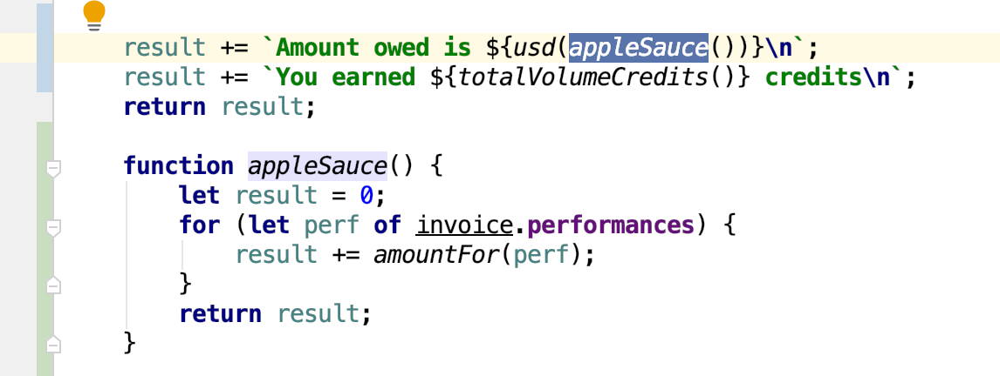

  - Rename Refactoring :

  - ```javascript
    function statement (invoice, plays) {
        let result = `Statement for ${invoice.customer}\n`;
    
        for (let perf of invoice.performances) {
    
            // print line for this order
            result += `  ${playFor(perf).name}: ${usd(amountFor(perf))} (${perf.audience} seats)\n`;
        }
    
        result += `Amount owed is ${usd(totalAmount())}\n`;
        result += `You earned ${totalVolumeCredits()} credits\n`;
        return result;
    
        function totalAmount() {
            let result = 0;
            for (let perf of invoice.performances) {
                result += amountFor(perf);
            }
            return result;
        }
    ```

- 테스트 수행

  - 테스트를 수행하고 그 결과를 확인한다.

