# 4. 계산 부분과 출력 부분을 분리하자.

## part4 준비
```
$ git add .
$ git commit -m "end of part3"
$ git checkout -B part4 tagPart4 -f
```

## 새로운 요구사항
- html 출력 기능 추가
	- htmlStatement(...) 필요.

## 코드를 살펴 보자

- 함수들이 복잡하게 연결되어 있어 이해하기 쉽지 않다.
	- calculation과 rendering 이 혼재되어 있다.

- 분리하면
	- calculation: 공통으로 사용
	- rendering: plainText / html 별도로 분기

- 관련 리팩토링 기법 :
  - Split Phase by Extract Function


## Plain Text Rendering 분리

- plain text render 를 담당하는 renderPlainText 함수를 추출한다.

- statement 함수 내부 코드를 전부 선택한다.
  - 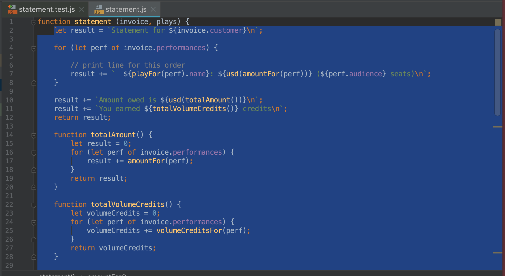
- Refactor "Extract Method" 를 선택한다.
  - 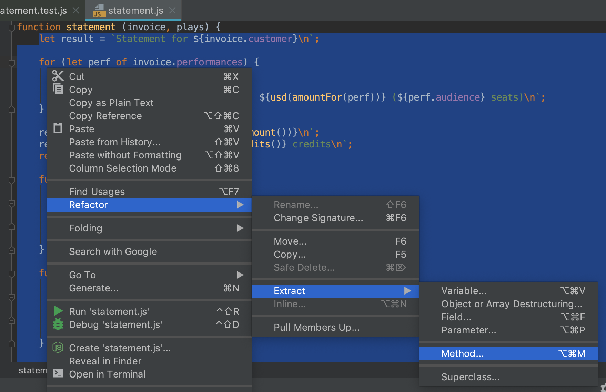
- Global scope 를 선택한다.
  - 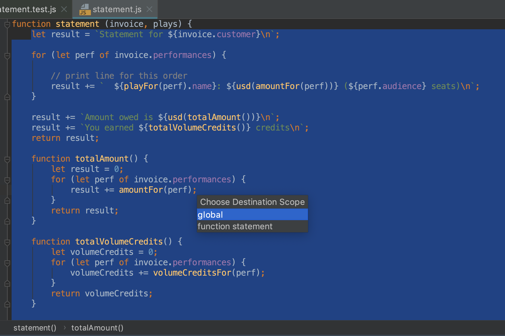
- renderPlainText
  - 
- 테스트 수행
  - 테스트가 전부 통과되었는지 확인한다.
- statement 함수를 파일의 최상단으로 이동시킨다.
  - 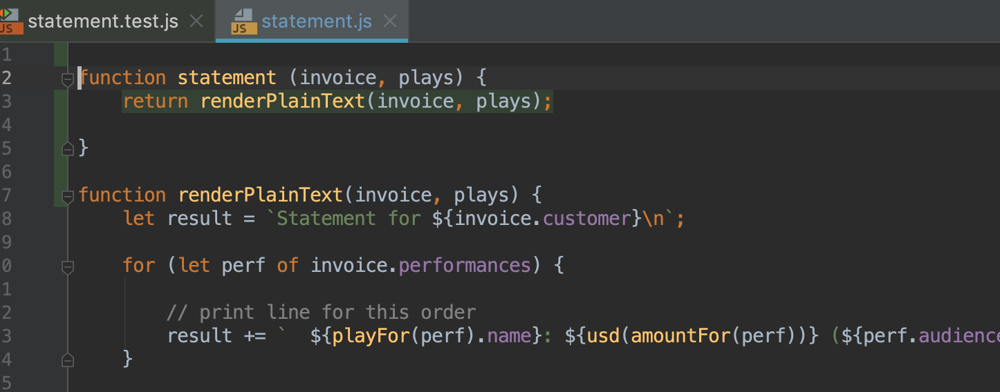
- 테스트 수행
  - 테스트가 전부 통과되었는지 확인한다.


## Intermediate Data Structure 추가

-  Intermediate data structure **statementData** 생성하여, statement 함수 내에 추가한다.
  - 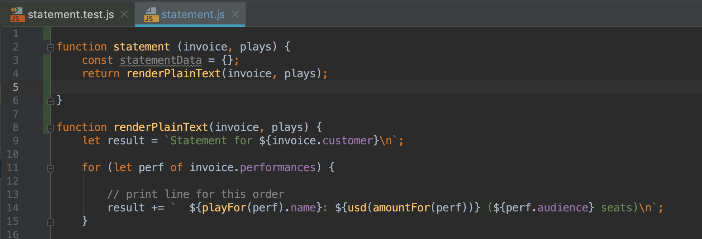
-  테스트 수행
  - 테스트가 전부 통과되었는지 확인한다.
-  생성한 statementData 를 renderPlainText 함수에 전달한다.
  - Refactor "Change Signature" 메뉴를 선택한다.
  - 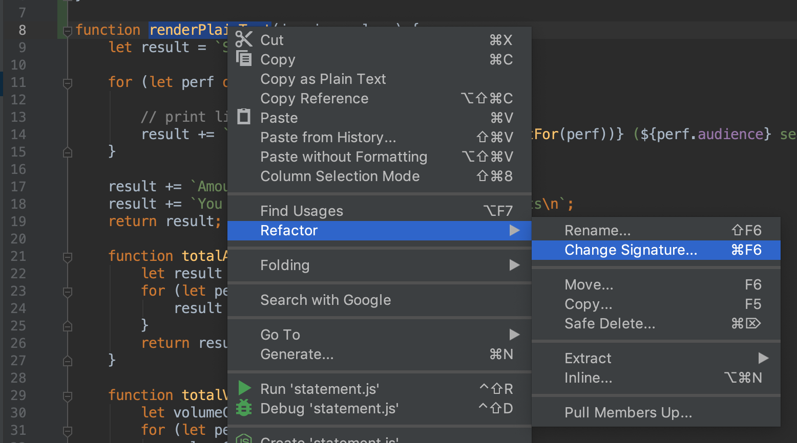
  - Parameter **data** 추가한다. "Value in the call" 에는 **statementData** 를 입력한다.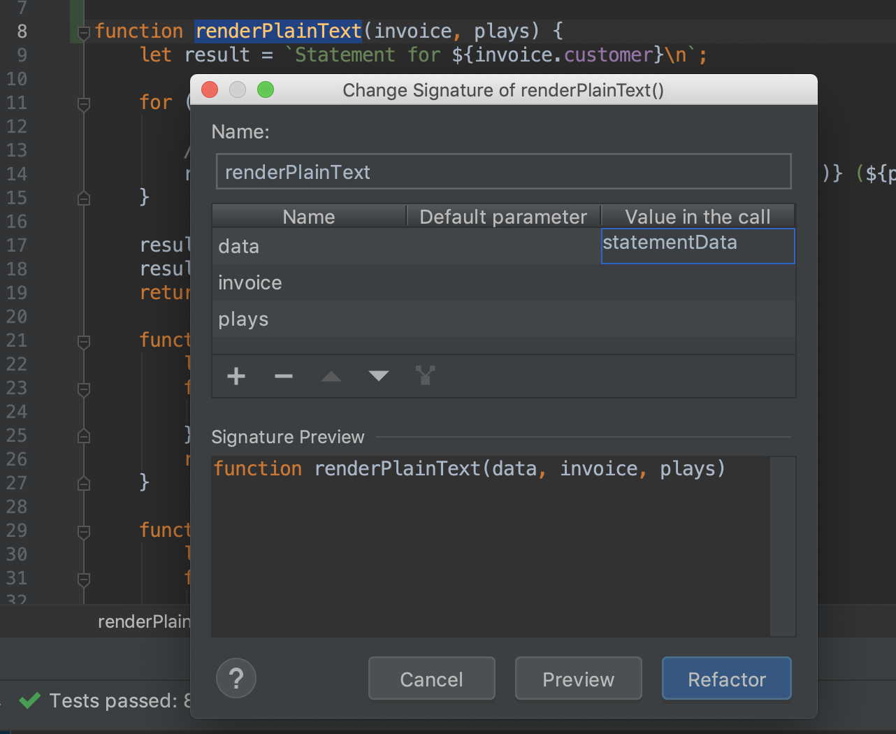
  - 리팩토링 후 : 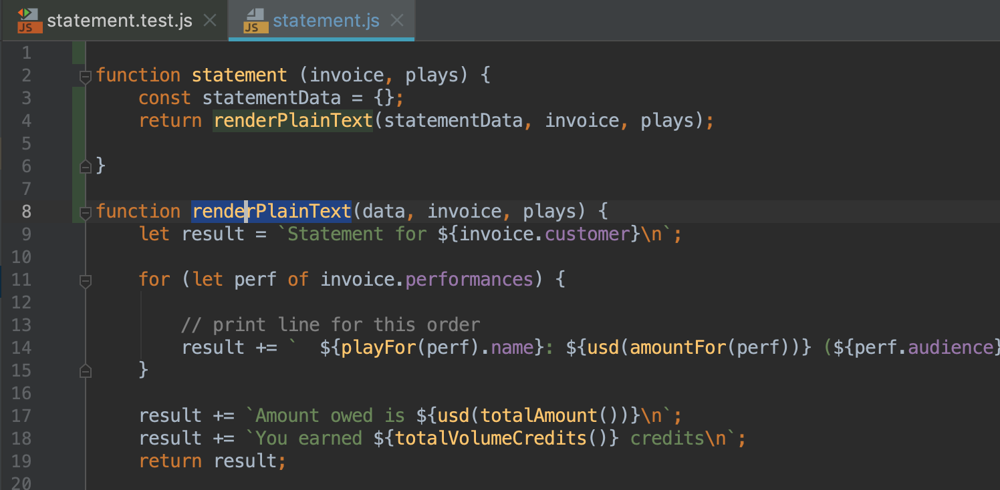
-  테스트 수행
  - 테스트가 전부 통과되었는지 확인한다.


## data.customer 전달

- statementData 에 invoice의 customer 를 추가하여 전달한다.
  - statementData 에 invoice.customer 를 추가한다.
  - 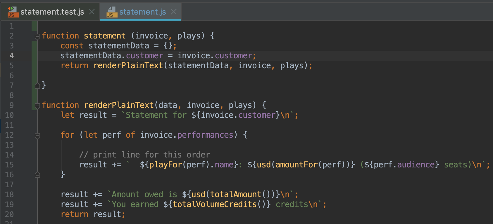
- 테스트 수행
  - 테스트가 전부 통과되었는지 확인한다.

- renderPlainText 함수 코드 내 customer 참조를 data.customer 로 변경한다.
  - invoice.customer  참조를 data.customer 참조로 변경한다.
  - 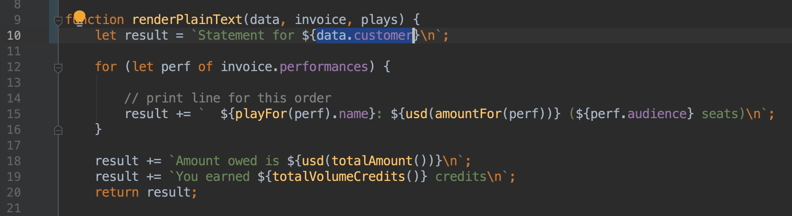
- 테스트 수행
  - 테스트가 전부 통과되었는지 확인한다.


## data.performances 전달

- statementData 에 invoice의 performances 를 추가하여 전달한다.
  - statementData 에 invoice.performances 를 전달한다.
  - 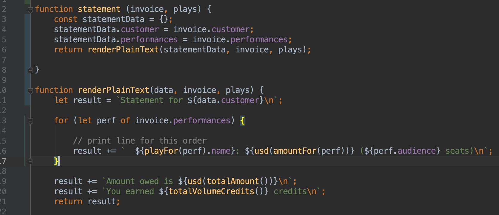
- 테스트 수행
  - 테스트가 전부 통과되었는지 확인한다.
- renderPlainText 코드 내에서 performances 참조하는 부분을 전부 data.performances 를 이용하도록 변경한다.
  - 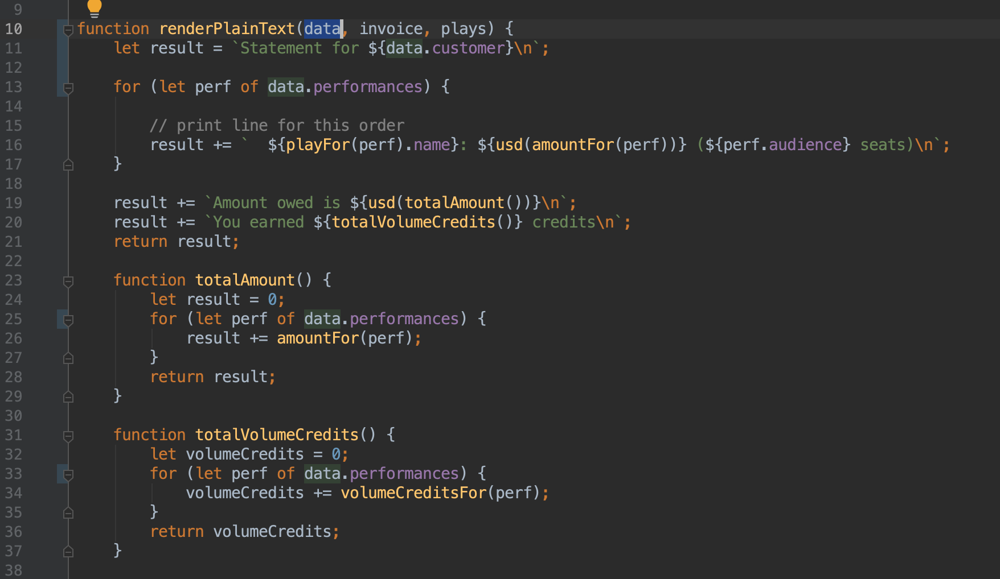
- 테스트 수행
  - 테스트가 전부 통과되었는지 확인한다.


## performance 객체 확장

- performance 를 통하여 필요한 정보를 전달하기 위해,  performance record 를 확장한다.

- ```
    function statement (invoice, plays) {
      const statementData = {};
      statementData.customer = invoice.customer;
      statementData.performances = invoice.performances.map(enrichPerformance);
      return renderPlainText(statementData, plays);
    
      function enrichPerformance(aPerformance) {
        const result = Object.assign({}, aPerformance);
        return result;
      }
    ```

- 테스트 수행

    - 테스트가 전부 통과되었는지 확인한다.

- 참고 사항 :

    - The idiom `result = Object.assign({}, aPerformance)` looks very odd to people unfamiliar to JavaScript. It performs a shallow copy.


## performance.play 전달

- renderPlainText 코드 내에서 play 객체 참조를 performance.play 로 변경하고자 한다.

- playFor 함수를 statement 내로 이동시킨다.

  - renderPlainText 함수 내에 존재하는 playFor 함수를 statement 함수로 이동시킨다.

  - ```
    function playFor(aPerformance) {
        return plays[aPerformance.playID];
    }
    ```

  - 이동 후 : 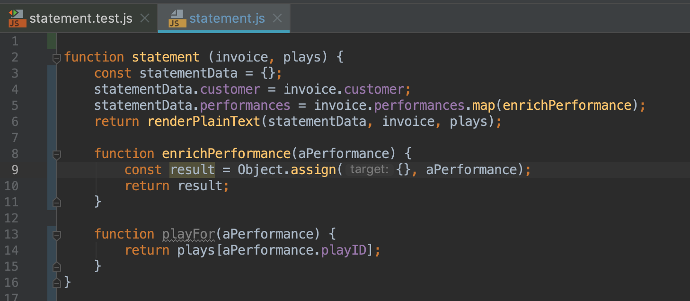

- enrichPerformance 함수를 이용하여 performance 에 play 개체를 전달한다.

  - 참조 코드 : 

  - ```
    function enrichPerformance(aPerformance) {
      const result = Object.assign({}, aPerformance);
      result.play = playFor(result);
      return result;
    }
    
    function playFor(aPerformance) {
      return plays[aPerformance.playID];
    }
    ```

  - 변경 후 내용 : 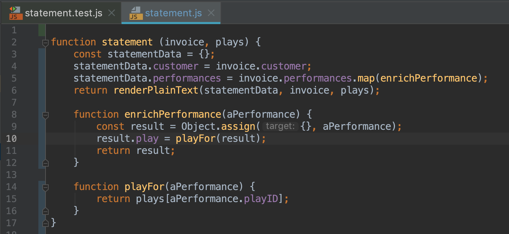

- 테스트 수행

  - 테스트가 전부 통과되었는지 확인한다. 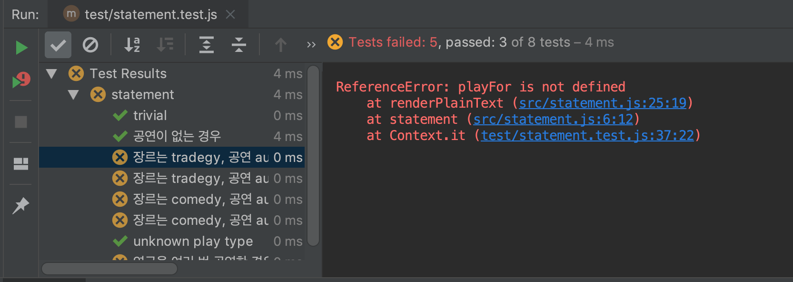


- renderPlainText 코드 내 playFor 함수 쿼리를 performance.play 참조로 변경한다.
  - renderPlainText  코드 내 :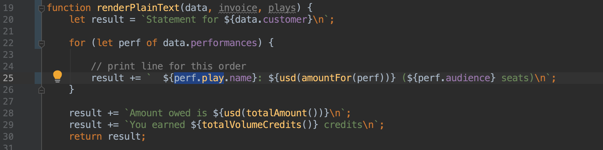
  - volumeCreditsFor 코드 내 :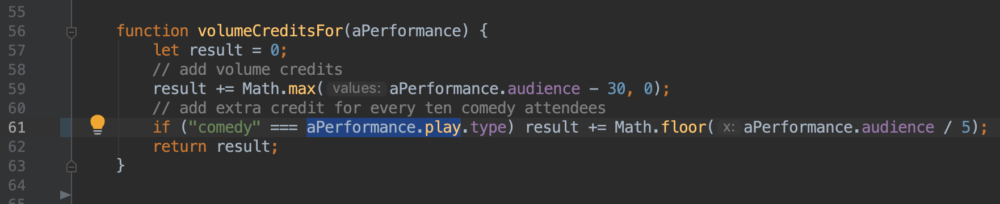
  - amoutFor 코드 내 :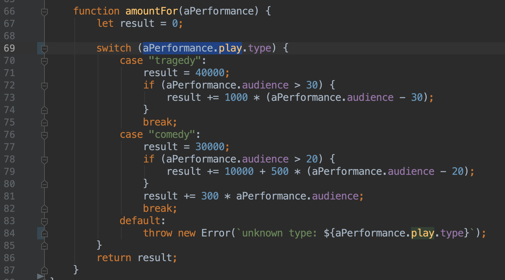
- 테스트 수행
  - 테스트가 전부 통과되었는지 확인한다. 


## performance.amount 전달

- amountFor 함수를 statement 함수 내로 코드를 이동한다.

  - 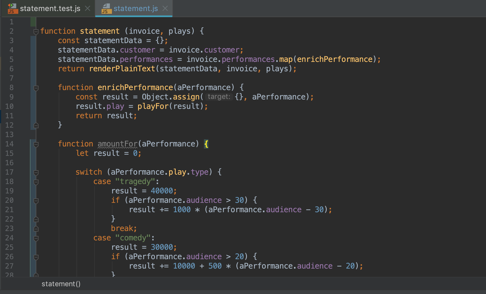

- enrichPerformance 함수를 이용하여 performance 에 amount 객체 추가

  - ```
    function enrichPerformance(aPerformance) {
      const result = Object.assign({}, aPerformance);
      result.play = playFor(result);
      result.amount = amountFor(result);
      return result;
    }
    
    function amountFor(aPerformance) {...}
    ```

- 테스트 수행

  - 테스트가 전부 통과되었는지 확인한다. 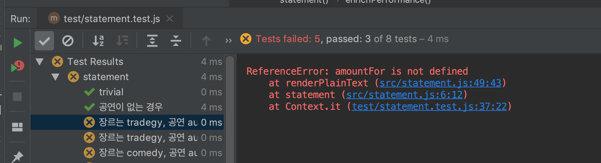

- renderPlainText 코드 내 amountFor 함수 쿼리를 performance.amount 참조로 변경한다.

  - renderPlainText 함수 내 : 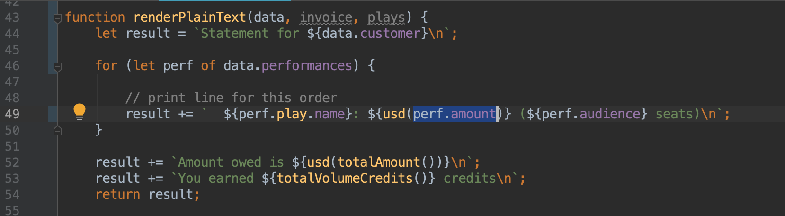
  - totalAmount 함수 내 : 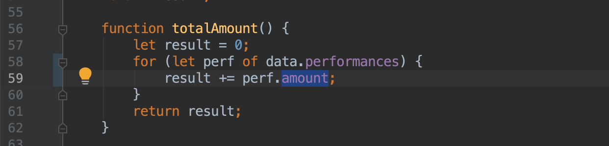

- 테스트 수행

  - 테스트가 전부 통과되었는지 확인한다. 


## performance.volumeCredits 전달

- renderPlainText volumeCreditsFor 함수를 statement 함수 내로 이동한다.

  - 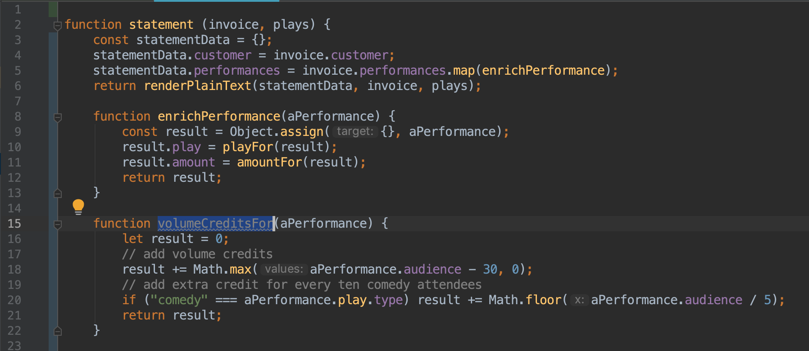

- enrichPerformance 함수를 이용하여 performance.volumeCredits 를 전달한다.

  - enrichPerformance 함수 내 volumeCredits 코드 예시 : 

  - ```
    function enrichPerformance(aPerformance) {
      const result = Object.assign({}, aPerformance);
      result.play = playFor(result);
      result.amount = amountFor(result);
      result.volumeCredits = volumeCreditsFor(result);
      return result;
    }
    
    function volumeCreditsFor(aPerformance) {...}
    ```

  - 코드 수정 후 : 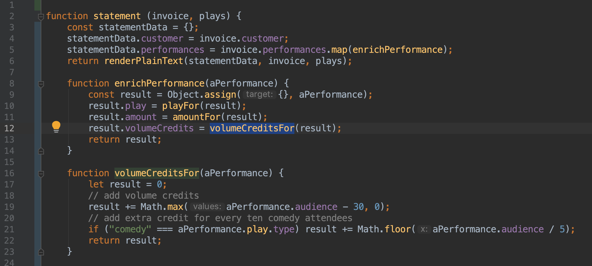

- 테스트 수행

  - 테스트가 전부 통과되었는지 확인한다. 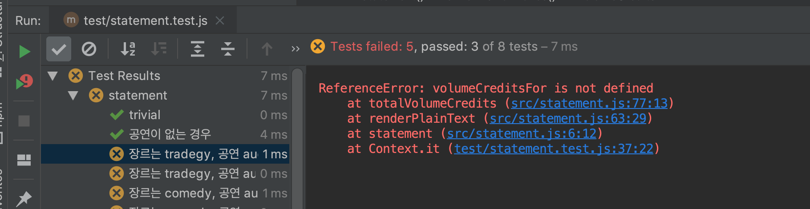

- renderPlainText 함수 코드 내 volumeCreditsFor 함수 참조를 performance.volumeCredits 로 변경한다.

  - totalVolumeCredits 함수 내 : 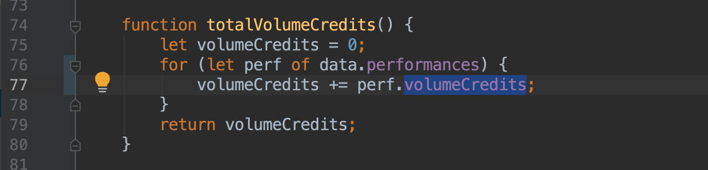


## data.totalAmount 전달

- totalAmount 함수 이동.

  - renderPlainText 함수 내에 존재하는 totalAmount 함수를 statement 함수로 이동시킨다.
  - 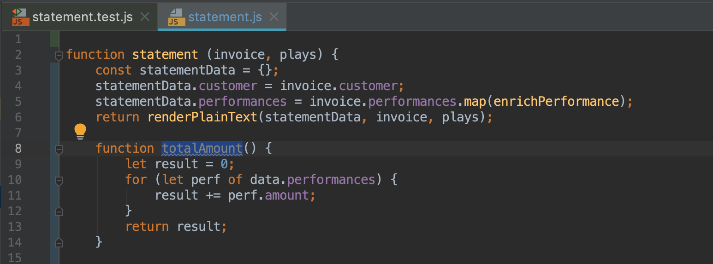

- data.totalAmount 추가

  - 코드 예시 : 

  - ```
    function statement (invoice, plays) {
        const statementData = {};
        statementData.customer = invoice.customer;
        statementData.performances = invoice.performances.map(enrichPerformance);
        statementData.totalAmount = totalAmount();
        return renderPlainText(statementData, invoice, plays);
    
        function totalAmount() {
            let result = 0;
            for (let perf of data.performances) {
                result += perf.amount;
            }
            return result;
        }
    ```

  - 코드 변경 후 : 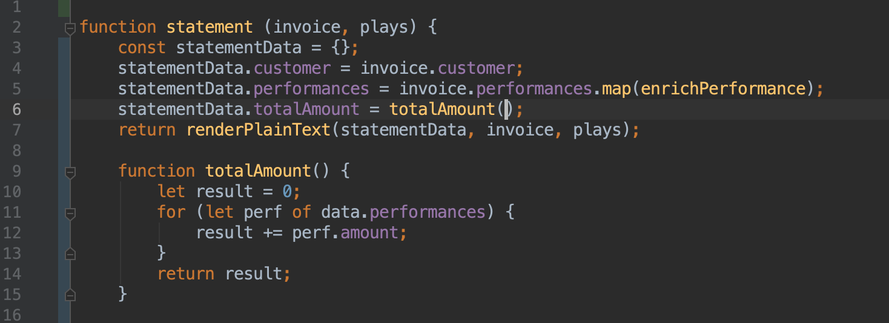

- 테스트 수행

  - 테스트가 전부 통과되었는지 확인한다. 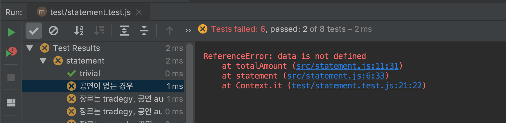

- totalAmount 함수에 data 파라미터 추가 

  - Refactor "Change Signature" 메뉴 선택 :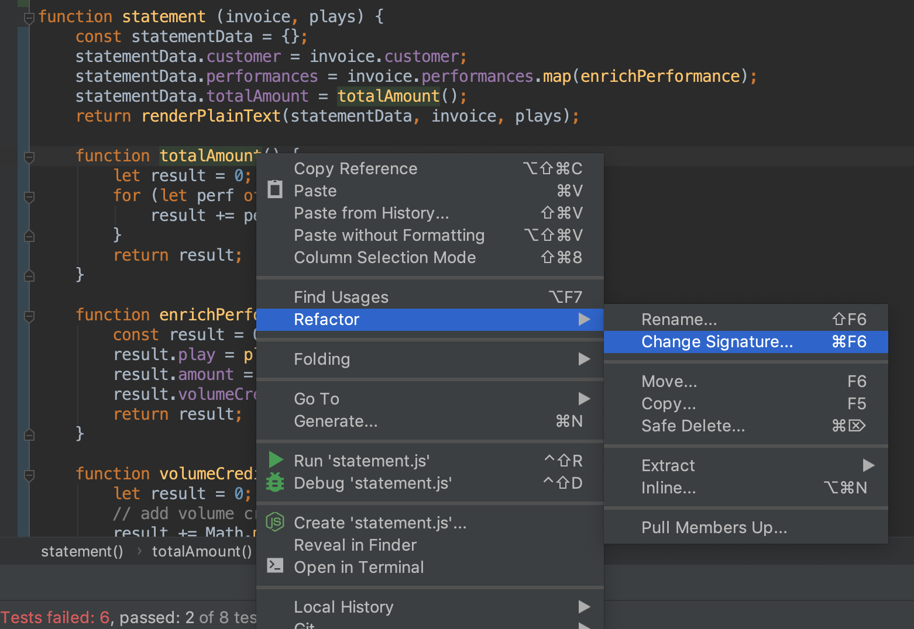

  - data 파라미터 추가 : 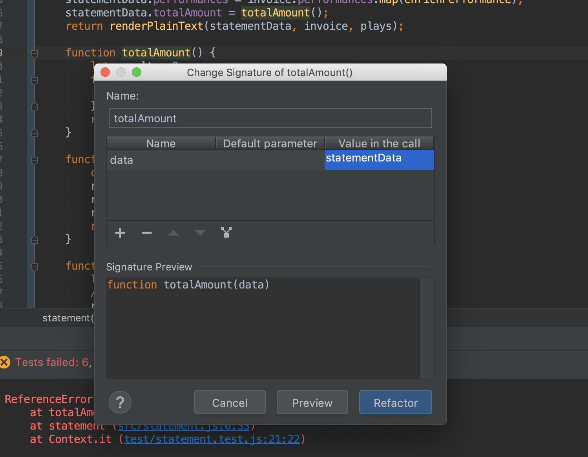

  - 변경 후 코드 예시 : 

    ```
    function statement (invoice, plays) {
        const statementData = {};
        statementData.customer = invoice.customer;
        statementData.performances = invoice.performances.map(enrichPerformance);
        statementData.totalAmount = totalAmount(statementData);
        return renderPlainText(statementData, invoice, plays);
    
        function totalAmount(data) {
            let result = 0;
            for (let perf of data.performances) {
                result += perf.amount;
            }
            return result;
        }
    
    ```

  - 코드 변경 후 : 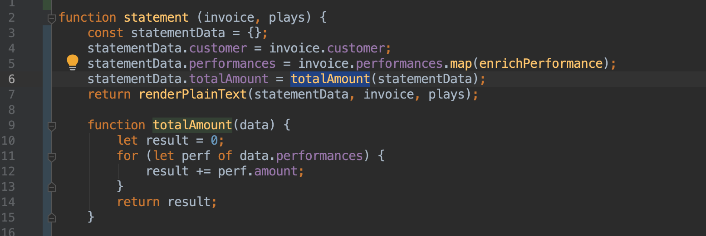

- renderPlainText 코드 수정 : 

  - 

- 테스트 수행

  - 테스트가 전부 통과되었는지 확인한다. 


## data.totalVolumeCredits 전달

- totalVolumeCredits 함수를 statement 함수 내로 이동한다.

  - 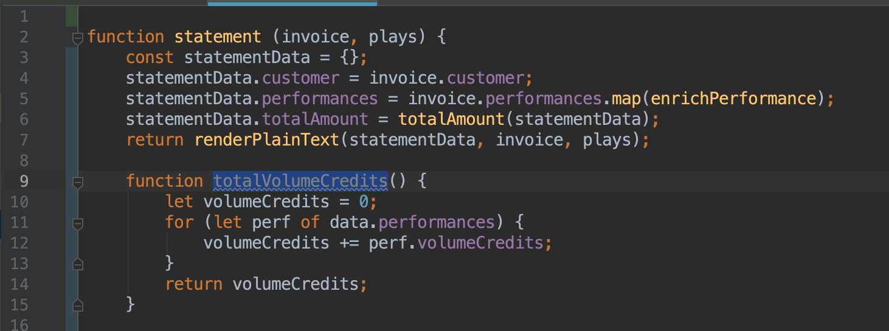

- data.totalVolumeCredits 추가

  -  코드 예시 : 

    ```
    function statement (invoice, plays) {
        const statementData = {};
        statementData.customer = invoice.customer;
        statementData.performances = invoice.performances.map(enrichPerformance);
        statementData.totalAmount = totalAmount(statementData);
        statementData.totalVolumeCredits = totalVolumeCredits();
        return renderPlainText(statementData, invoice, plays);
    
        function totalVolumeCredits() {
            let volumeCredits = 0;
            for (let perf of data.performances) {
                volumeCredits += perf.volumeCredits;
            }
            return volumeCredits;
        }
    
    ```

  -  코드 변경 후 : 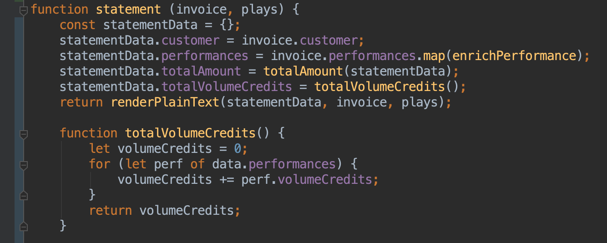

- totalVolumeCredits 파라미터 전달 

  - Refactor "ChangeSignature" 메뉴 선택 : 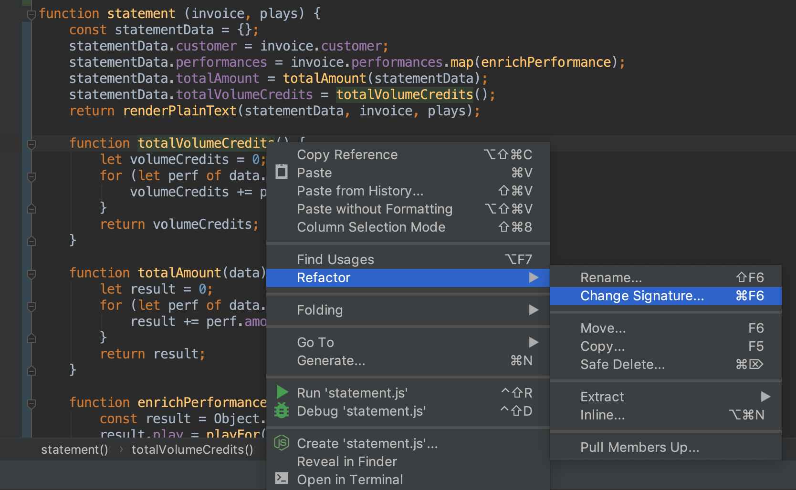
  - data 파라미터 추가 : 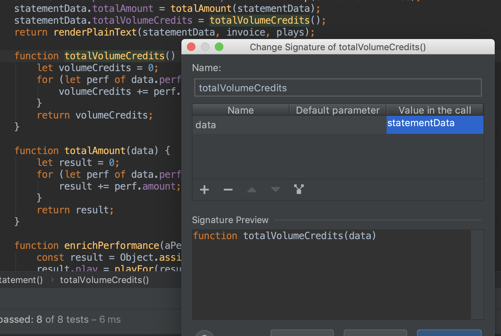
  - 리팩토링 후 : 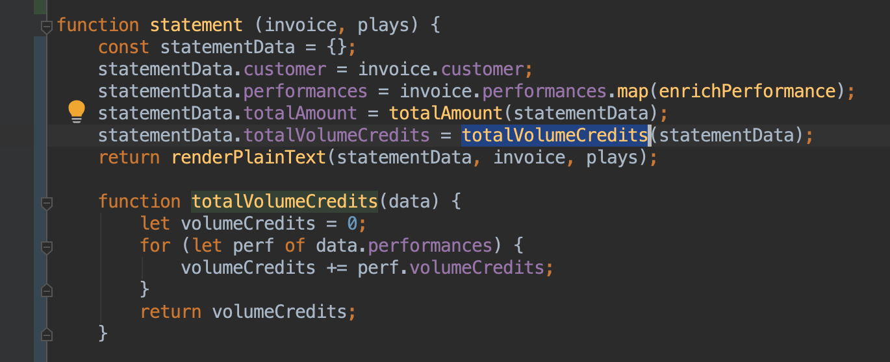

- 테스트 수행

  - 테스트가 전부 통과되었는지 확인한다. 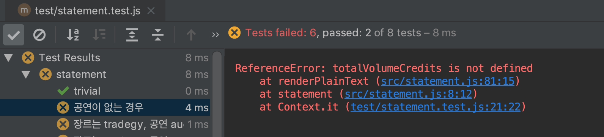

- renderPlainText 코드 수정 : 

  - 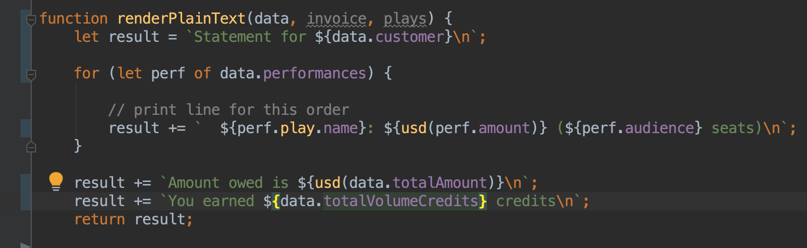

- 테스트 수행

  - 테스트가 전부 통과되었는지 확인한다. 


## Replace Loop with Pipeline

- totalAmount

  - ```
    function totalAmount(data) {
      return data.performances
        .reduce((total, p) => total + p.amount, 0);
    }
    ```

- 테스트 수행

  - 테스트가 전부 통과되었는지 확인한다. 

- totalVolumeCredits

  - ```
    function totalVolumeCredits(data) {
      return data.performances
        .reduce((total, p) => total + p.volumeCredits, 0);
    }
    ```


## renderPlainText 파라미터 정리

-  renderPlainText 함수 파라미터를 정리한다.
  - 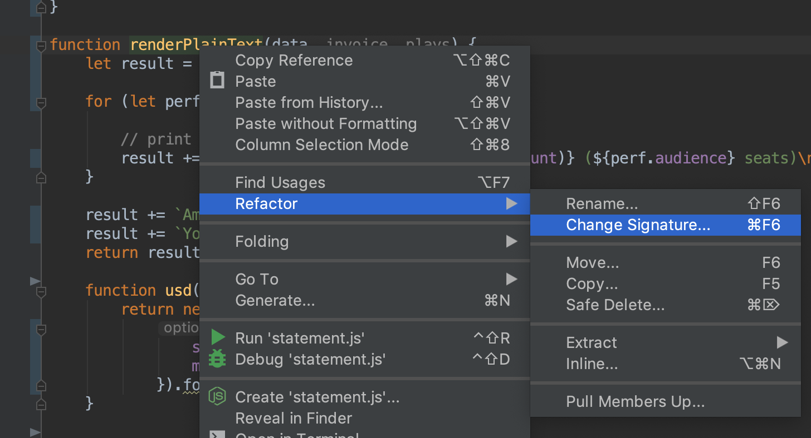
  - 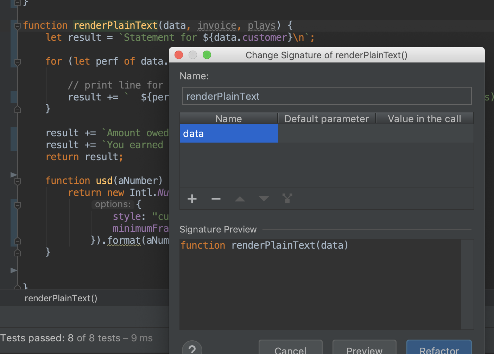
- 테스트 수행
  - 테스트가 전부 통과되었는지 확인한다. 


## createStatementData 함수 분리

- Intermediate Data Structure 를 생성하는 코드를 별도 함수로 분리한다.

  - 코드 예시 : 

    ```
    
    function statement (invoice, plays) {
        return renderPlainText(createStatementData(invoice, plays));
    }
    
    function createStatementData(invoice, plays) {
        const statementData = {};
        statementData.customer = invoice.customer;
        statementData.performances = invoice.performances.map(enrichPerformance);
        statementData.totalAmount = totalAmount(statementData);
        statementData.totalVolumeCredits = totalVolumeCredits(statementData);
        return statementData;
    
        function totalVolumeCredits(data) {
            return data.performances
                .reduce((total, p) => total + p.volumeCredits, 0);
        }
    ```

  - 코드 수정 후 : 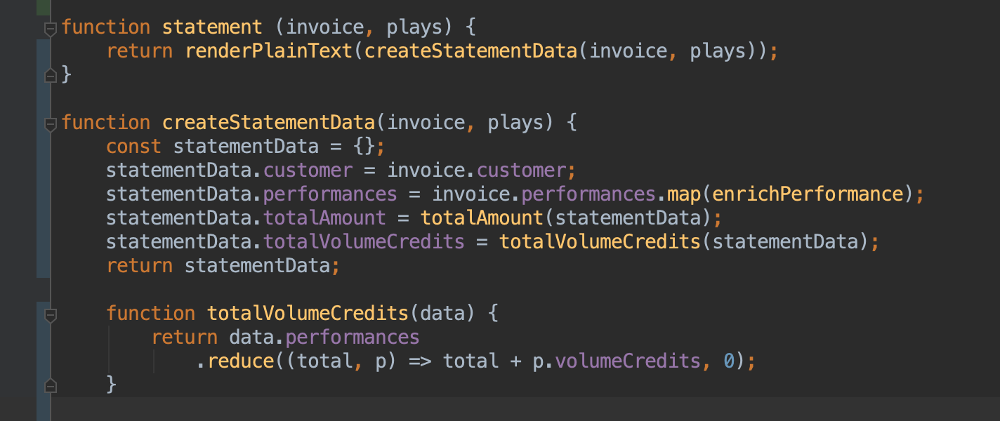

- 테스트 수행

  - 테스트가 전부 통과되었는지 확인한다. 


## createStatementData.js 파일 분리

- createStatementData 코드를 별도 파일로 분리한다.

- createStatementData.js 파일 생성

  - src 폴더를 선택하고 오른쪽 마우스 버튼을 하여 새로운 JavaScript  파일을 생성한다.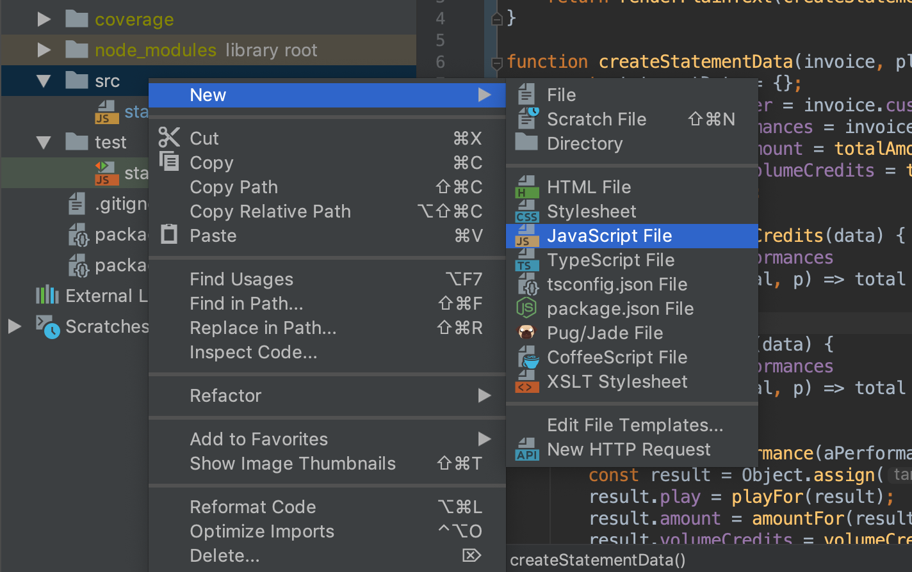
  - createStatementData 를 파일명으로 입력한다. : 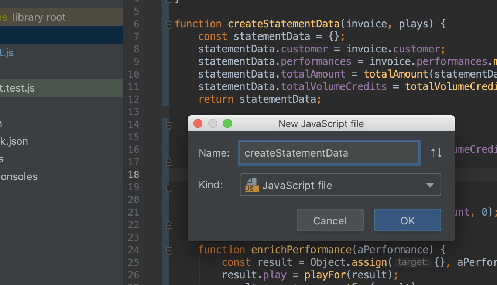
  - 파일 생성 후 : 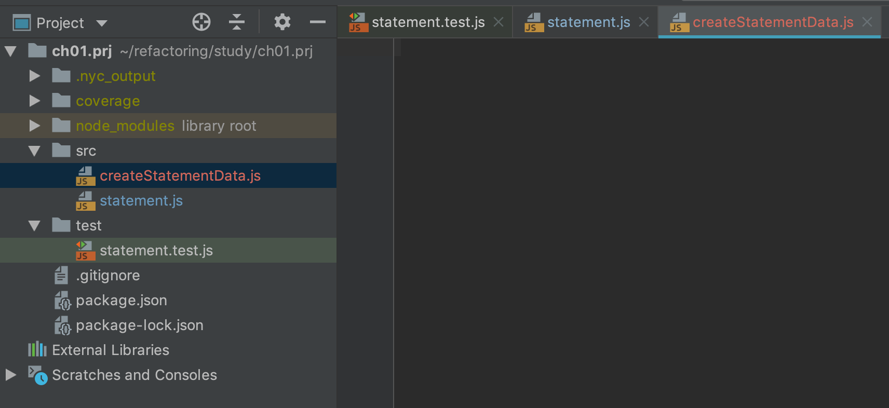

- 테스트 수행

  - 테스트가 전부 통과되었는지 확인한다. 

- createStatementData 함수를 createStatementData.js 파일로 이동시킨다.

  - createStatementData.js 코드 예시 : 

    ```
    function createStatementData(invoice, plays) {
        const statementData = {};
        statementData.customer = invoice.customer;
        statementData.performances = invoice.performances.map(enrichPerformance);
        statementData.totalAmount = totalAmount(statementData);
        statementData.totalVolumeCredits = totalVolumeCredits(statementData);
        return statementData;
    
        function totalVolumeCredits(data) {
            return data.performances
                .reduce((total, p) => total + p.volumeCredits, 0);
        }
    
        function totalAmount(data) {
            return data.performances
                .reduce((total, p) => total + p.amount, 0);
        }
    
        function enrichPerformance(aPerformance) {
            const result = Object.assign({}, aPerformance);
            result.play = playFor(result);
            result.amount = amountFor(result);
            result.volumeCredits = volumeCreditsFor(result);
            return result;
        }
    
        function volumeCreditsFor(aPerformance) {
            let result = 0;
            // add volume credits
            result += Math.max(aPerformance.audience - 30, 0);
            // add extra credit for every ten comedy attendees
            if ("comedy" === aPerformance.play.type) result += Math.floor(aPerformance.audience / 5);
            return result;
        }
    
        function amountFor(aPerformance) {
            let result = 0;
    
            switch (aPerformance.play.type) {
                case "tragedy":
                    result = 40000;
                    if (aPerformance.audience > 30) {
                        result += 1000 * (aPerformance.audience - 30);
                    }
                    break;
                case "comedy":
                    result = 30000;
                    if (aPerformance.audience > 20) {
                        result += 10000 + 500 * (aPerformance.audience - 20);
                    }
                    result += 300 * aPerformance.audience;
                    break;
                default:
                    throw new Error(`unknown type: ${aPerformance.play.type}`);
            }
            return result;
        }
    
        function playFor(aPerformance) {
            return plays[aPerformance.playID];
        }
    }
    
    module.exports = createStatementData;
    ```

  - statement.js 코드 예시 : 

    ```
    var createStatementData = require('../src/createStatementData');
    
    function statement (invoice, plays) {
        return renderPlainText(createStatementData(invoice, plays));
    }
    
    function renderPlainText(data) {
        let result = `Statement for ${data.customer}\n`;
    
        for (let perf of data.performances) {
    
            // print line for this order
            result += `  ${perf.play.name}: ${usd(perf.amount)} (${perf.audience} seats)\n`;
        }
    
        result += `Amount owed is ${usd(data.totalAmount)}\n`;
        result += `You earned ${data.totalVolumeCredits} credits\n`;
        return result;
    
        function usd(aNumber) {
            return new Intl.NumberFormat("en-US",
                {
                    style: "currency", currency: "USD",
                    minimumFractionDigits: 2
                }).format(aNumber / 100);
        }
    }
    
    module.exports = statement;
    ```

- 테스트 수행

  - 테스트가 전부 통과되었는지 확인한다. 


## HTML Rendering 추가

- renderHtml 함수 추가

  - renderHtml 코드 예시 : 

    ```
    function renderHtml (data) {
      let result = `<h1>Statement for ${data.customer}</h1>\n`;
      result += "<table>\n";
      result += "<tr><th>play</th><th>seats</th><th>cost</th></tr>";
      for (let perf of data.performances) {
        result += `  <tr><td>${perf.play.name}</td><td>${perf.audience}</td>`;
        result += `<td>${usd(perf.amount)}</td></tr>\n`;
      }
      result += "</table>\n";
      result += `<p>Amount owed is <em>${usd(data.totalAmount)}</em></p>\n`;
      result += `<p>You earned <em>${data.totalVolumeCredits}</em> credits</p>\n`;
      return result;
    }
    ```

- htmlStatement 함수 추가

  - htmlStatement 코드 예시 : 

    ```
    function htmlStatement (invoice, plays) {
      return renderHtml(createStatementData(invoice, plays));
    }
    ```

- 테스트 수행

  - 테스트가 전부 통과되었는지 확인한다. 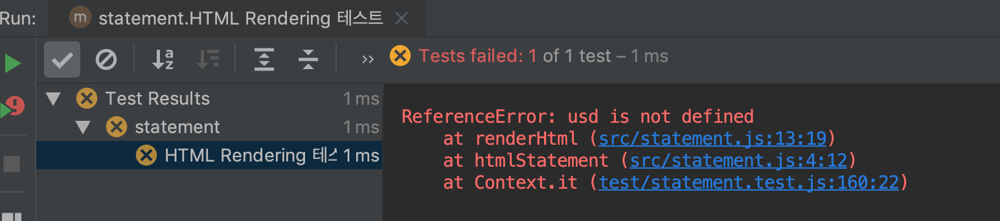
  - usd 함수가 정의되어 있지 않다고 에러가 발생한다.

- usd 함수를 global scope 로 변경한다.

  - statement.js 코드 예시 : 

  - ```
    var createStatementData = require('../src/createStatementData');
    
    function htmlStatement (invoice, plays) {
        return renderHtml(createStatementData(invoice, plays));
    }
    
    function renderHtml (data) {
        let result = `<h1>Statement for ${data.customer}</h1>\n`;
        result += "<table>\n";
        result += "<tr><th>play</th><th>seats</th><th>cost</th></tr>";
        for (let perf of data.performances) {
            result += `  <tr><td>${perf.play.name}</td><td>${perf.audience}</td>`;
            result += `<td>${usd(perf.amount)}</td></tr>\n`;
        }
        result += "</table>\n";
        result += `<p>Amount owed is <em>${usd(data.totalAmount)}</em></p>\n`;
        result += `<p>You earned <em>${data.totalVolumeCredits}</em> credits</p>\n`;
        return result;
    }
    
    function statement (invoice, plays) {
        return renderPlainText(createStatementData(invoice, plays));
    }
    
    function renderPlainText(data) {
        let result = `Statement for ${data.customer}\n`;
    
        for (let perf of data.performances) {
    
            // print line for this order
            result += `  ${perf.play.name}: ${usd(perf.amount)} (${perf.audience} seats)\n`;
        }
    
        result += `Amount owed is ${usd(data.totalAmount)}\n`;
        result += `You earned ${data.totalVolumeCredits} credits\n`;
        return result;
    
    }
    
    function usd(aNumber) {
        return new Intl.NumberFormat("en-US",
            {
                style: "currency", currency: "USD",
                minimumFractionDigits: 2
            }).format(aNumber / 100);
    }
    
    module.exports = {statement,htmlStatement};
    ```

- 테스트 수행

  - 테스트가 전부 통과되었는지 확인한다. 


## HTML Rendering 테스트 작성

- test 코드 작성 

  - statement.test.js 파일 htmlStatement 함수 import 

    ```
    var assert = require('assert');
    var {statement,htmlStatement} = require('../src/statement');
    
    ```

  - 테스트 코드 추가 

    ```
    it('HTML Rendering 테스트',() => {
            let invoice = {
                customer: "Gildong",
                performances: [
                    {
                        playID: 0,
                        audience: 30
                    }
                ]
            };
    
            let plays = {
                0: {
                    "name": "Hamlet",
                    "type": "tragedy"
                }
            };
            
            let result = htmlStatement(invoice,plays);
            assert.equal(result,"");
        });
    ```

- 테스트 수행

  - 테스트가 전부 통과되었는지 확인한다. 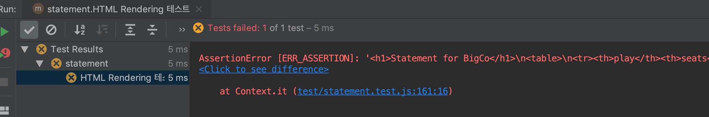

  

- 에러 테스트 코드 수정 

  - "Click to see difference" 를 클릭하여 HTML 결과를 복사한다.

  - 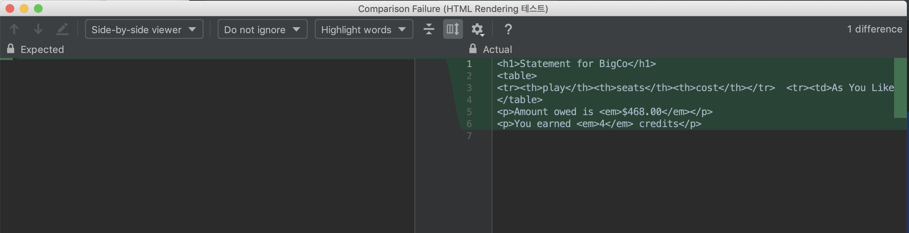

  - assert.equal 문을 수정해 준다.

    ```
        it('HTML Rendering 테스트',() => {
            let invoice = {
                customer: "Gildong",
                performances: [
                    {
                        playID: 0,
                        audience: 30
                    }
                ]
            };
    
            let plays = {
                0: {
                    "name": "Hamlet",
                    "type": "tragedy"
                }
            };

            const result = htmlStatement(invoice, plays);
            assert.equal(result, "<h1>Statement for Gildong</h1>\n" +
                "<table>\n" +
                "<tr><th>play</th><th>seats</th><th>cost</th></tr>  <tr><td>Hamlet</td><td>$400.00</td><td>30</td></tr>\n" +
                "</table>\n" +
                "<p>Amount owed is <em>$400.00</em></p>\n" +
                "<p>You earned <em>0</em> credits</p>\n");
            
        });
    ```

- 테스트 수행

  - 테스트가 전부 통과되었는지 확인한다. 

## 정리하며...

- 단계 나누기 + intermediate data 활용

- Move Method 절차 - baby step
	- assign to intermediate data
	- copy method
	- replace method to intermediate data
	- inline method

- loop 장벽 띄어 넘기
	- Object.assign({}, originalData)	
