= 유형에 따라 계산하는 로직을 재구성해보자😀

=== 개요
* 계산 로직을 추가, 변경하기 위해서 amountFor에 switch-case 안에 로직이 계속 추가하거나 수정해야 함
* 구조적으로 계산하는 로직에만 더 집중할 수 없을까?
* 관련 리팩토링 기법 => https://refactoring.com/catalog/replaceConditionalWithPolymorphism.html[Replace Conditional with Polymorphism]
* 단계별로 코드가 수정될 때마다 테스트 동작은 필수 

=== Creating a Performance Calculator

===== PerformanceCalculator 클래스 생성 
* PerformanceCalculator 클래스 생성

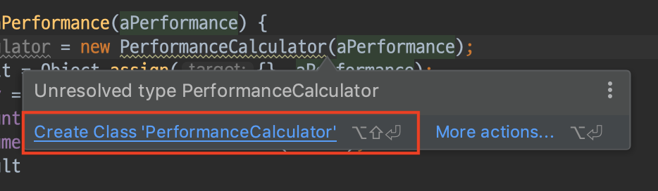

[source, js]
----
class PerformanceCalculator {
    constructor(aPerformance) {
        this.performance = aPerformance;
    }
}

function enrichPerformance(aPerformance) {
    let calculator = new PerformanceCalculator(aPerformance);

    // ...
----

===== PerformanceCalculator 클래스 생성자로 play 전달
* 코드 추가 

[source, js]
----
class PerformanceCalculator {
    constructor(aPerformance, aPlay) {
        this.performance = aPerformance;
        this.play = aPlay;
    }
}

function enrichPerformance(aPerformance) {
    let calculator = new PerformanceCalculator(aPerformance, playFor(result));
    
    // ...
----

* 테스트 실행

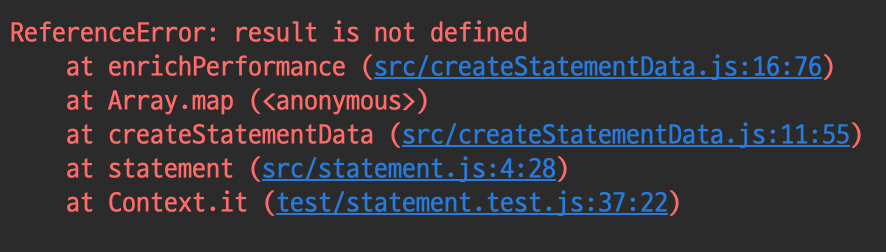

* 코드 추가 

[source, js]
----
function enrichPerformance(aPerformance) {
    let calculator = new PerformanceCalculator(aPerformance, playFor(aPerformance));
    const result = Object.assign({}, aPerformance);
    result.play = calculator.play;

    // ...
----

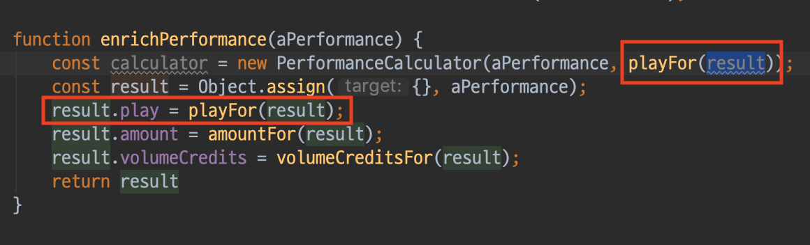

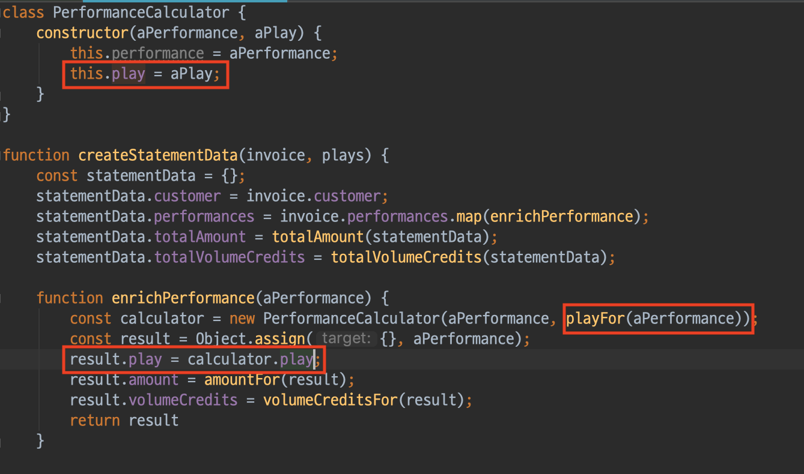

* 테스트 실행

=== Moving Functions into the Calculator

===== ammountFor 함수를 PerformanceCalculator 클래스 내부로 옮김
* amountFor 함수를 PerformanceCalculator 클래스로 복사

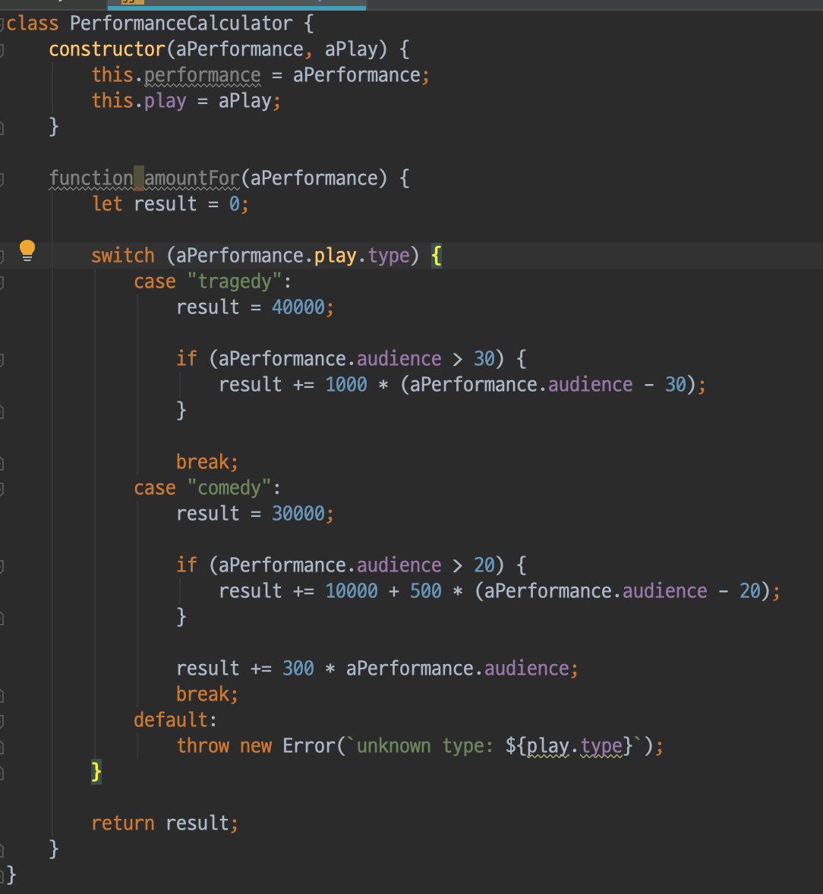

* PerformanceCalculator 클래스에서 `amount` getter로 변경

[source, js]
----
class PerformanceCalculator {
    // ...

    get amount() {
        let result = 0;

        switch (this.play.type) {
            case "tragedy":
                result = 40000;

                if (this.performance.audience > 30) {
                    result += 1000 * (this.performance.audience - 30);
                }

                break;
            case "comedy":
                result = 30000;

                if (this.performance.audience > 20) {
                    result += 10000 + 500 * (this.performance.audience - 20);
                }

                result += 300 * this.performance.audience;
                break;
            default:
                throw new Error(`unknown type: ${play.type}`);
        }

        return result;
    }
}
----

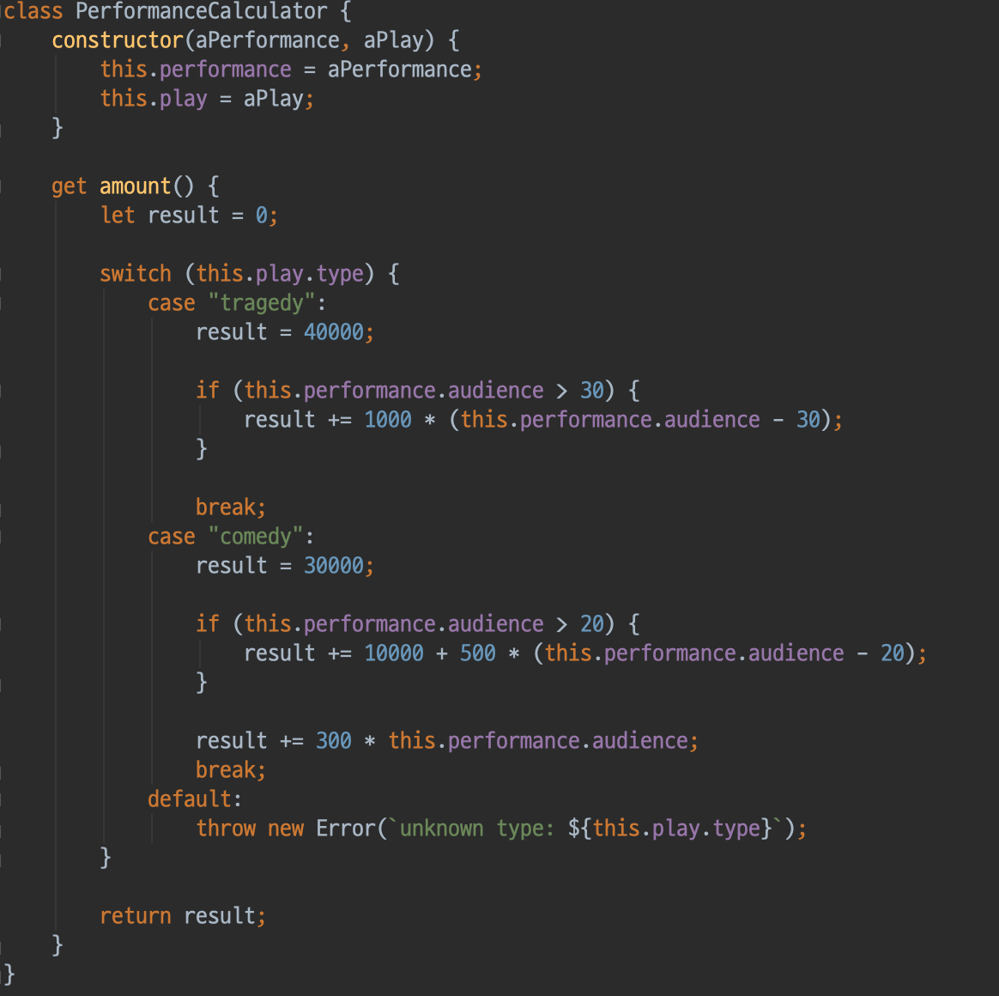

* 테스트 실행

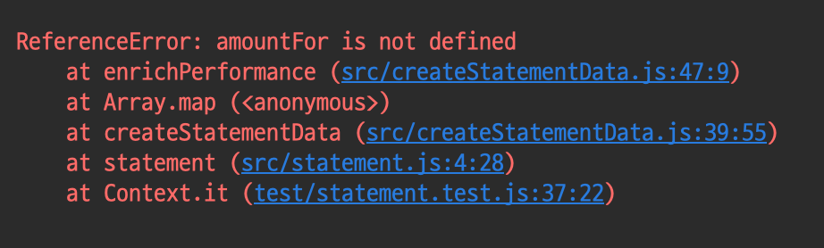

* 코드 추가 

[source, js]
----
result.amount = calculator.amount;
----

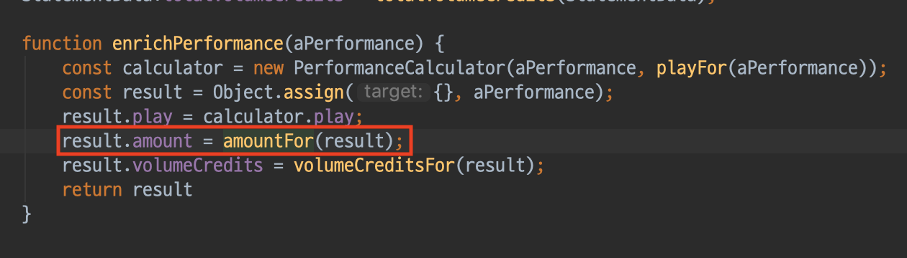

* 테스트 실행
* amountFor 함수 제거 

===== PerformanceCalculator 클래스 내부로 volumeCreditsFor 함수 이동
* volumeCreditsFor를 PerformanceCalculator 클래스로 복사

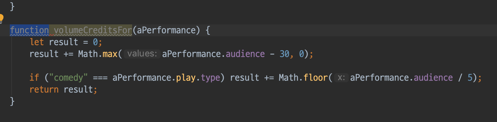

* PerformanceCalculator 클래스에서 volumeCredits getter로 변경

[source, js]
----
class PerformanceCalculator {
    // ...

    get volumeCredits() {
        let result = 0;
        result += Math.max(this.performance.audience - 30, 0);
        // add extra credit for every ten comedy attendees
        if ("comedy" === this.play.type) result += Math.floor(this.performance.audience / 5);
        return result;
    }
}
----

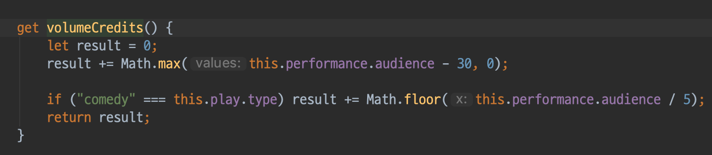

* 테스트 실행 

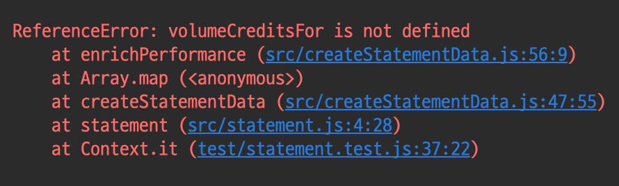

* 코드 추가

[source, js]
----
result.volumeCredits = calculator.volumeCredits;
----

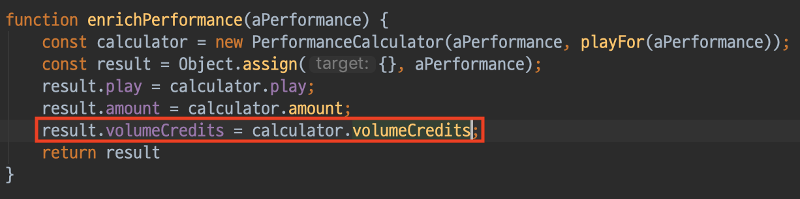

* volumeCreditsFor 함수 제거 

=== Making the Performance Calculator Polymorphic

===== createPerformanceCalculator 함수 추출

* `createPerformanceCalculator` global scope로 함수 추출  

image:./images/13.png[]

* 변수명 변경 

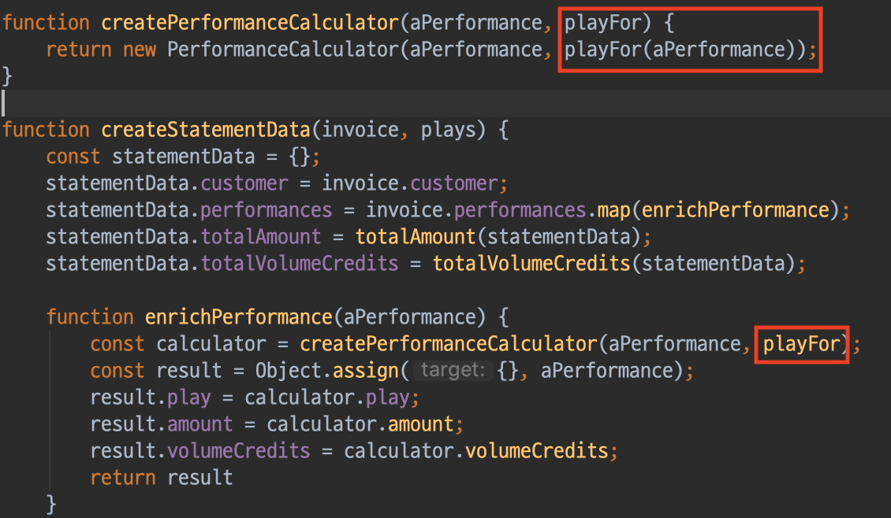

===== TragedyCalculator 클래스 생성
* createPerformanceCalculator 함수에서 Play-type에 따른 switch-case 작성

[source, js]
----
function createPerformanceCalculator(aPerformance, aPlay) {
    switch (aPlay.type) {
        case "tragedy": return new TragedyCalculator(aPerformance, aPlay);
    }

    return new PerformanceCalculator(aPerformance, aPlay);	
}
----

* TragedyCalculator 클래스 생성 

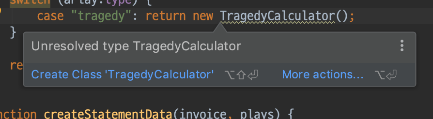

* PerformanceCalculator 를 상속받고 PerformanceCalculator에 있는 amount 로직 중, `tragedy` 에 해당하는 로직 처리

[source, js]
----
class TragedyCalculator extends PerformanceCalculator {
    get amount() {
        let result = 40000;

        if (this.performance.audience > 30) {
            result += 1000 * (this.performance.audience - 30);
        }

        return result;
    }
}
----

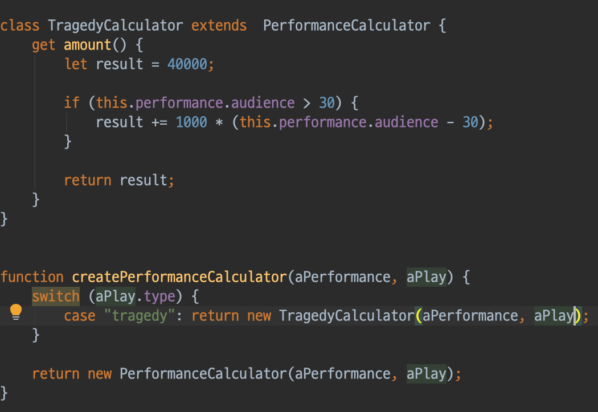

* 테스트 실행

===== ComedyCalculator 클래스 생성
* createPerformanceCalculator 함수에서 Play-type에 따른 switch-case 작성

[source, js]
----
function createPerformanceCalculator(aPerformance, aPlay) {
    switch (aPlay.type) {
        case "tragedy": return new TragedyCalculator(aPerformance, aPlay);	   
        case "comedy": return new ComedyCalculator(aPerformance, aPlay);
    }	    

    return new PerformanceCalculator(aPerformance, aPlay);
}
----

* PerformanceCalculator를 상속받고 PerformanceCalculator에 있는 amount 로직 중, `comedy` 에 해당하는 로직 처리

[source, js]
----
class ComedyCalculator extends PerformanceCalculator {
    get amount() {
        let result = 30000;
        if (this.performance.audience > 20) {
            result += 10000 + 500 * (this.performance.audience - 20);
        }

        result += 300 * this.performance.audience;
        return result;
    }
}
----

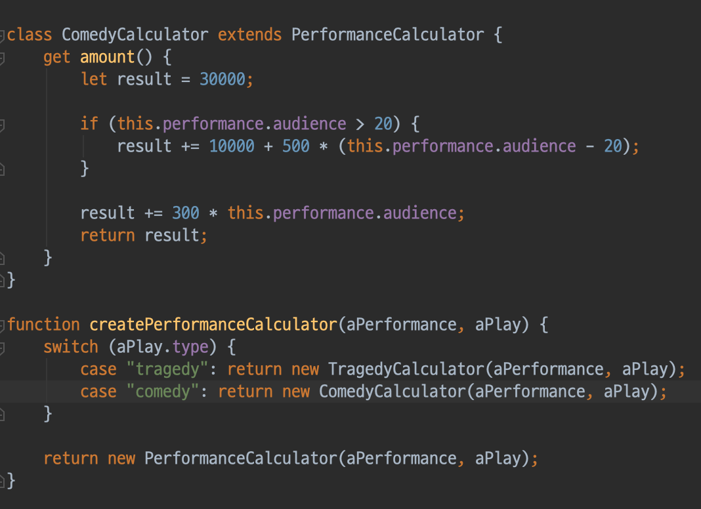

* 테스트 실행

===== volumeCredits 로직 처리
* PerformanceCalculator, ComedyCalculator 에 맞게 volumeCredits 로직 분리

[source, js]
----
// PerformanceCalculator
get volumeCredits() {
    return Math.max(this.performance.audience - 30, 0);
}

// ComedyCalculator
get volumeCredits() {
    return super.volumeCredits + Math.floor(this.performance.audience / 5);
}
----

* 테스트 실행

===== default 셋팅
* 코드 추가 

[source, js]
----
function createPerformanceCalculator(aPerformance, aPlay) {
    switch (aPlay.type) {
        case "tragedy": return new TragedyCalculator(aPerformance, aPlay);	   
        case "comedy": return new ComedyCalculator(aPerformance, aPlay);
        default: return new PerformanceCalculator(aPerformance, aPlay);
    }	    
}
----

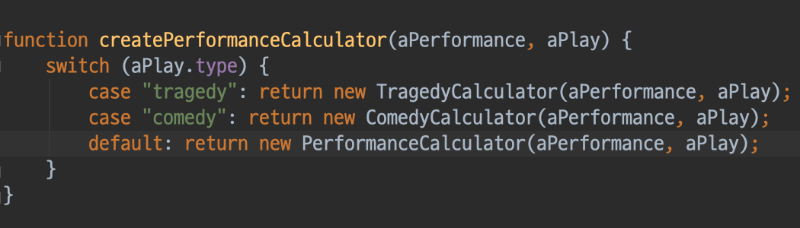

* 테스트 실행

=== 불필요한 로직 제거 

===== PerformanceCalculator 클래스에서 불필요한 로직 제거 

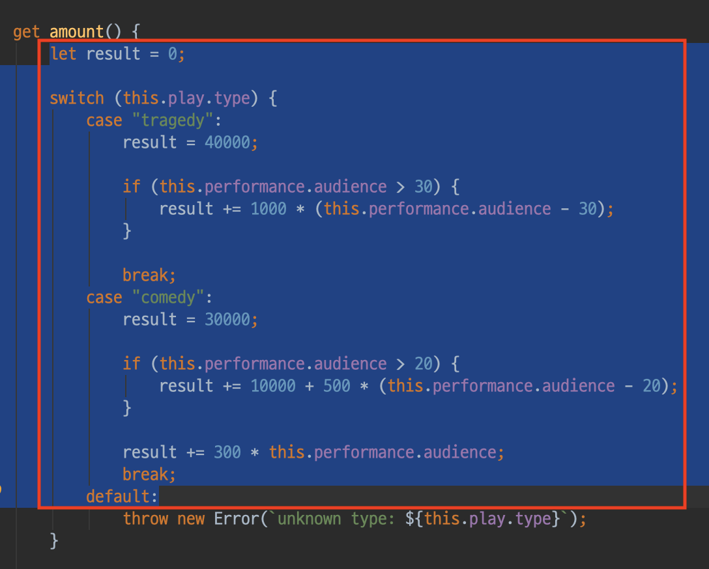

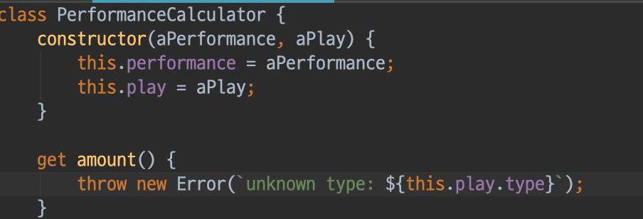
